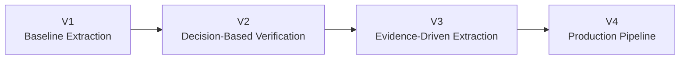
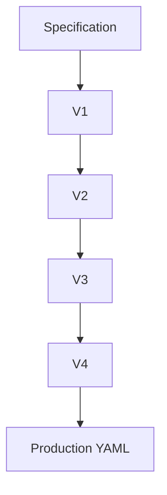
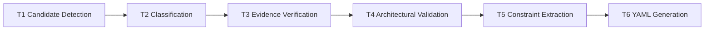
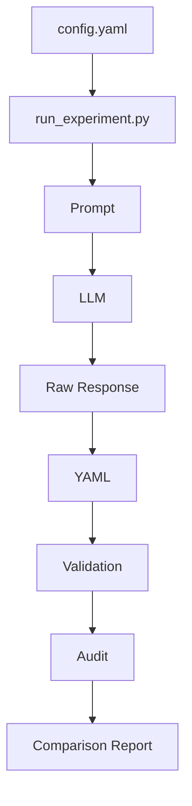

# RISCV-Architectural-Parameters-Extraction# RISCV-Architectural-Parameters-Extraction

> **AI-Assisted Extraction of RISC-V Architectural Parameters from the RISC-V ISA Specifications using Large Language Models (LLMs)**

---

## Overview

The RISC-V ISA specifications contain hundreds of architectural decisions distributed across thousands of pages of documentation. While these specifications are written for human readers, transforming them into a structured machine-readable representation remains a challenging task.

This repository explores how modern Large Language Models (LLMs) can automatically extract **architectural parameters** from RISC-V specifications and convert them into **Unified Database (UDB) compatible YAML**.

The project investigates prompt engineering, automated validation, evidence-based extraction, hallucination detection, benchmarking across multiple LLMs, and schema mapping, resulting in a complete end-to-end extraction pipeline.

---

## Project Goals

The primary objectives of this work are:

* Automatically identify architectural parameters from RISC-V ISA specifications.
* Distinguish architectural parameters from constants, constraints, and implementation details.
* Generate deterministic YAML compatible with the RISC-V Unified Database (UDB).
* Minimize hallucinations using evidence-driven prompting.
* Benchmark multiple state-of-the-art Large Language Models.
* Provide automated validation and comparison tools.
* Build a reproducible extraction workflow.

---

## Repository Workflow


---

# Project Evolution

This repository was developed incrementally through multiple prompt generations before reaching the final production pipeline.



Each version addressed limitations observed in the previous one, gradually improving precision, reproducibility, and explainability.

---

# Repository Structure

```text
RISCV-Architectural-Parameters-Extraction
│
├── prompts/
├── scripts/
├── snippets/
├── results/
├── candidates/
├── comparisons/
├── audits/
├── UDB_YAML/
├── ground_truth/
├── model_comparison/
├── automation/
│
├── prompt_comparison.md
├── Spring_2026_Study.md
├── UDB_YAML_Structure.md
└── README.md
```

---

# Complete Extraction Pipeline


---

# Key Features

* Prompt evolution across four progressively improved versions.
* Evidence-driven architectural parameter extraction.
* Multi-model benchmarking.
* Automated YAML validation.
* Hallucination detection.
* Ground-truth evaluation.
* UDB-compatible YAML generation.
* Reproducible experimental pipeline.
* Complete benchmarking reports.
* Automation support.

---

# Prompt Engineering

Four prompt generations were developed throughout the project.

| Version | Primary Idea                                      |
| ------- | ------------------------------------------------- |
| **V1**  | Baseline extraction using specification keywords. |
| **V2**  | Introduced decision-based validation (T1–T3).     |
| **V3**  | Added evidence verification (T1–T4).              |
| **V4**  | Full production pipeline (T1–T6).                 |

---

## Prompt Evolution



---

# Multi-Stage Production Pipeline (V4)



---

# Supported Models

The extraction pipeline was benchmarked using **12 Large Language Models**.

| Provider    | Model                       |
| ----------- | --------------------------- |
| OpenAI      | GPT-5.5                     |
| Anthropic   | Claude Sonnet 5             |
| Google      | Gemini 3                    |
| Google      | Gemini 3.6 Flash            |
| DeepSeek    | DeepSeek V4 Flash           |
| Zhipu AI    | GLM-5.2                     |
| Moonshot AI | K2.6                        |
| Alibaba     | Qwen                        |
| Mistral AI  | Mistral Medium 3.5          |
| Perplexity  | Sonar                       |
| NVIDIA      | Ising Calibration 1.5       |
| Microsoft   | Proprietary Microsoft Build |

Model metadata is generated automatically by:

```text
scripts/model_info.py
```

and stored inside

```text
model_comparison/
```

---

# Experimental Workflow

```mermaid
flowchart LR

Prompt

--> Run 1

--> Run 2

--> Run 3

Run 1 --> Comparison

Run 2 --> Comparison

Run 3 --> Comparison

Comparison --> Final Analysis
```

---
# Part 2 — Repository Structure, Workflow, Results & Future Work


## Repository Structure

```
RISCV-Architectural-Parameters-Extraction/
├── prompts/                 # Four prompt versions (V1–V4)
├── scripts/                 # Automation scripts
├── snippets/                # Input specification snippets
├── results/                 # Raw LLM outputs
├── comparisons/             # Cross-model comparisons
├── audits/                  # Hallucination reports
├── candidates/              # Candidate extraction outputs
├── UDB_YAML/                # Final UDB-compatible YAML
├── ground_truth/            # Expert annotations
├── automation/              # Batch experiment runner
├── model_comparison/        # Model metadata
├── docs/
└── README.md
```

---

# Repository Workflow


---

# Project Directory Overview

| Directory | Purpose |
|-----------|----------|
| prompts/ | Four generations of extraction prompts |
| scripts/ | Complete automation pipeline |
| snippets/ | Input ISA specification snippets |
| results/ | Generated responses and YAML files |
| audits/ | Hallucination detection reports |
| candidates/ | Candidate parameter discovery |
| comparisons/ | Model benchmarking reports |
| UDB_YAML/ | Final normalized UDB output |
| ground_truth/ | Expert annotated reference YAML |
| automation/ | Batch execution utilities |
| model_comparison/ | Metadata of evaluated LLMs |

---

# Automation Pipeline

The repository includes a complete automation framework for benchmarking multiple LLMs.

Instead of manually querying each model, every experiment follows a standardized pipeline that:

- loads specification snippets
- applies the selected prompt version
- records model metadata
- stores raw responses
- extracts YAML
- validates outputs
- audits hallucinations
- generates comparison reports

---

## Automation Flow



---

# Implemented Scripts

| Script | Purpose |
|---------|----------|
| extract.py | Complete extraction workflow |
| validate.py | YAML validation |
| compare.py | Cross-model comparison |
| candidate_detector.py | General candidate discovery |
| riscv_candidate_detector.py | RISC-V specific filtering |
| evidence_auditor.py | Evidence verification |
| schema_mapper.py | Challenge YAML → UDB YAML conversion |
| model_info.py | Collect model metadata |
| report_generator.py | Generate benchmark summaries |

---

# Prompt Evolution

The repository documents four successive prompt generations.


Each version introduces additional validation stages, stronger evidence requirements, and improved architectural reasoning.

---

# Experimental Dataset

Two Privileged ISA specification snippets were used throughout benchmarking.

| Specification | Topic |
|--------------|-------|
| Privileged ISA 19.3.1 | Cache Block Size |
| Privileged ISA 2.1 | CSR Address Space |

These snippets contain both true architectural parameters and several implementation details, making them useful benchmarks for evaluating extraction quality.

---

# Evaluated Large Language Models

The benchmark includes twelve state-of-the-art LLMs from multiple providers.

- GPT-5.5
- Claude Sonnet 5
- Gemini 3
- Gemini 3.6 Flash
- DeepSeek V4 Flash
- GLM-5.2
- K2.6
- Qwen
- Mistral Medium 3.5
- Sonar Perplexity
- Ising Calibration 1.5
- Proprietary Microsoft Build

Each model was evaluated using the same prompts and identical specification snippets.

---

# Generated Artifacts

Each experimental run produces several reproducible outputs.

```
results/
    raw_response.md
    extracted_parameters.yaml
    run_metadata.json

validation_report.md

hallucination_report.md

comparison.md

UDB YAML
```

---

# Benchmark Outputs

The framework enables comparison across several dimensions.

- Parameter recall
- False positives
- Hallucination rate
- Evidence quality
- Constraint extraction
- YAML correctness
- Schema compliance
- UDB compatibility

---

# Reproducibility

Every experiment is fully reproducible.

Each run records:

- Prompt version
- Model information
- Timestamp
- Raw model output
- Generated YAML
- Validation report
- Hallucination report

This allows independent verification of every extracted parameter.

---

# Future Improvements

Potential extensions include:

- Support for the complete RISC-V ISA
- Automatic specification chunking
- Additional prompt optimization
- Multi-specification benchmarking
- Larger expert-annotated ground truth datasets
- Integration with future Unified Database updates
- Continuous benchmarking pipeline

---

# Research Contributions

This repository contributes:

- A complete benchmark for architectural parameter extraction.
- Four progressively improved prompt versions.
- A reproducible LLM evaluation framework.
- Automated YAML validation.
- Hallucination detection through evidence auditing.
- Candidate detection pipelines.
- Cross-model benchmarking.
- UDB-compatible schema generation.
- Ground truth methodology for evaluation.
- Analysis of current limitations and future research directions.

---

# Citation

If you use this repository in your research, please cite:

```
Muhammad Waleed Akram.

RISCV Architectural Parameters Extraction.

GitHub Repository.

2026.
```

---

# Acknowledgements

This work was developed as part of the Linux Foundation Mentorship (LFX) Fall 2026 application process for the RISC-V Unified Database project.

The project builds upon discussions from the Spring 2026 mentorship, ongoing community feedback, and the evolving RISC-V Unified Database ecosystem.

Special thanks to the RISC-V Unified Database maintainers and contributors for their valuable discussions, feedback, and open-source collaboration.

