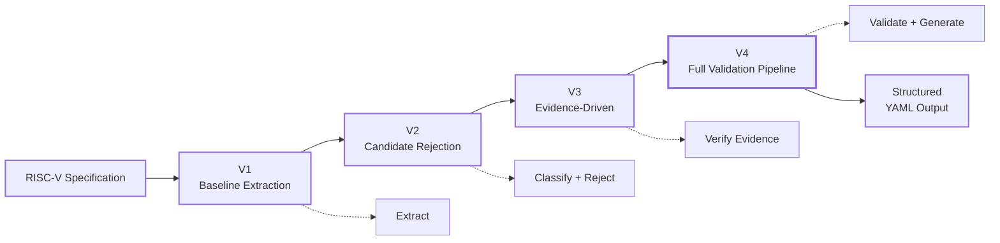
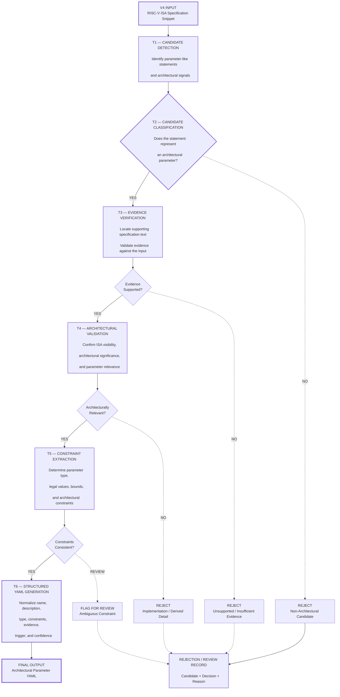

<div align="center">


# AI-Assisted Extraction of RISC-V Architectural Parameters using Large Language Models


</div>


*Benchmarking • Prompt Engineering • Validation • Evidence Auditing • UnifiedDB YAML Generation*

## Project Overview
This project investigates the use of **Large Language Models (LLMs)** to automatically extract architectural parameters from RISC-V ISA specifications and convert them into structured representations suitable for the **RISC-V Unified Database (UDB)**. The workflow includes prompt refinement, candidate detection and classification, YAML validation, evidence auditing, multi-model comparison, ground-truth evaluation, and UDB schema mapping. **Twelve LLMs** are benchmarked across the process to evaluate their ability to distinguish genuine architectural parameters from non-architectural or unsupported information. The result is a reproducible end-to-end pipeline from **RISC-V specification text to validated UDB-shaped YAML**. But before doing that, I studied Unified DB in details and prepared Notes [UDB_YAML_Structure.md](UDB_YAML_Structure.md). Also studied PRs of LFX Spring and made [Spring_2026_Study.md](Spring_2026_Study.md).Moreover , prepared [ground_truth](ground_truth/README.md).


## Snippets
- [Priveleged 19.3.1](snippets/priveleged_19.3.1.txt)
- [Priveleged 2.1](snippets/priveleged_2.1.txt)

# Approach



The prompt architecture was developed iteratively from a basic extraction prompt into a structured, evidence-aware and validation-oriented workflow. Each version addresses limitations identified in the previous version while keeping the output schema sufficiently consistent for comparison.

## Prompt Evolution

| Version                                                                                                                            | Focus             | Main Improvement                                                                                                            |
| ---------------------------------------------------------------------------------------------------------------------------------- | ----------------- | --------------------------------------------------------------------------------------------------------------------------- |
| **[V1 — Baseline Extraction](https://github.com/Waleed99i/RISCV-Architectural-Parameters-Extraction/tree/main/prompts/v1)**        | Direct extraction | Establishes the basic parameter extraction and YAML generation workflow.                                                    |
| **[V2 — Candidate Rejection](https://github.com/Waleed99i/RISCV-Architectural-Parameters-Extraction/tree/main/prompts/v2)**        | Classification    | Adds explicit rejection of non-architectural candidates and architectural validation.                                       |
| **[V3 — Evidence-Driven Extraction](https://github.com/Waleed99i/RISCV-Architectural-Parameters-Extraction/tree/main/prompts/v3)** | Evidence          | Adds evidence excerpts, trigger tracking, confidence, and stronger constraint verification.                                 |
| **[V4 — Production Pipeline](https://github.com/Waleed99i/RISCV-Architectural-Parameters-Extraction/tree/main/prompts/v4)**        | Full workflow     | Combines detection, rejection, validation, evidence verification, constraint checking and automation-ready YAML generation. |

Each prompt version contains the same four supporting files:

* `system_prompt.md` — defines the model's role, rules and extraction methodology.
* `user_prompt.md` — provides the specification input and task instructions.
* `expected_output_schema.yaml` — defines the required YAML output structure.
* `README.md` — documents the purpose and behavior of that prompt version.

---

# Results and Validation Report

I ran 3 times for better accuracy. You can checkout [results](results). Moreover , wrote [validate.py](scripts/validate.py) which generates `validation_report.md` under each result (of each run). It mainly checks:
- YAML Format Validation
- Required Fields Check
- Schema Compliance
- Data Consistency

   

# Best Version: V4

**V4 is the final and most complete prompt architecture developed in the project.** See [prompt_comparison.md](prompt_comparison.md). Rather than treating extraction as a single LLM operation, it organizes the task into a sequence of checks covering candidate identification, rejection, architectural relevance, evidence, constraints and structured output. This makes V4 suitable not only for individual extraction experiments but also for the automated benchmarking and validation pipeline used throughout the repository.

| Capability                   |  V1 |    V2   |    V3   |  V4 |
| ---------------------------- | :-: | :-----: | :-----: | :-: |
| Parameter extraction         |  ✓  |    ✓    |    ✓    |  ✓  |
| YAML formatting              |  ✓  |    ✓    |    ✓    |  ✓  |
| Candidate rejection          |  ✗  |    ✓    |    ✓    |  ✓  |
| Architectural validation     |  ✗  |    ✓    |    ✓    |  ✓  |
| ISA visibility analysis      |  ✗  |    ✓    |    ✓    |  ✓  |
| Evidence excerpts            |  ✗  |    ✗    |    ✓    |  ✓  |
| Trigger tracking             |  ✗  |    ✗    |    ✓    |  ✓  |
| Confidence estimation        |  ✗  |    ✗    |    ✓    |  ✓  |
| Constraint verification      |  ✗  | Partial |    ✓    |  ✓  |
| Rejection explanations       |  ✗  |    ✓    |    ✓    |  ✓  |
| Automation-ready output      |  ✗  | Partial | Partial |  ✓  |
| Production benchmark support |  ✗  |    ✗    | Partial |  ✓  |

### V4 Workflow



# Models Evaluated

The project evaluates **12 Large Language Models from 12 different model/provider ecosystems**, allowing the extraction pipeline to be tested across models with substantially different architectures, context limits, and capabilities. All models were evaluated using the same specification snippets and the same prompt-generation methodology, with the purpose of comparing extraction quality, consistency, evidence handling, and architectural classification rather than relying on the behavior of a single model. The evaluated models are **Claude Sonnet 5 (Anthropic)**, **DeepSeek V4-Flash-0731 (DeepSeek)**, **Gemini 3 (Google)**, **Gemini 3.6 Flash (Google)**, **GLM-5.2 (Zhipu AI)**, **GPT-5.5 (OpenAI)**, **Ising-Calibration-1.5 (NVIDIA)**, **K2.6 (Moonshot AI)**, **Mistral Medium 3.5 (Mistral AI)**, **Proprietary Microsoft Build (Microsoft/Copilot)**, **Qwen (Alibaba Tongyi Lab)**, and **Sonar-Perplexity (Perplexity AI)**. Their reported context c?utm_source=chatgpt.comapacities range from **4,096 tokens to more than one million tokens**, making the benchmark representative of models with significantly different context capabilities. The model information is maintained separately in the repository so that each experiment can be associated with the exact model configuration used during extraction.

| Model                       | Provider           |             Reported Context Length |
| --------------------------- | ------------------ | ----------------------------------: |
| Claude Sonnet 5             | Anthropic          |                    1,048,576 tokens |
| DeepSeek V4-Flash-0731      | DeepSeek           |                    1,048,576 tokens |
| Gemini 3                    | Google             |                     Up to 1M tokens |
| Gemini 3.6 Flash            | Google             |                    1,048,576 tokens |
| GLM-5.2                     | Zhipu AI           |                         128K tokens |
| GPT-5.5                     | OpenAI             |                    1,048,576 tokens |
| Ising-Calibration-1.5       | NVIDIA             |                        4,096 tokens |
| K2.6                        | Moonshot AI        | 256K tokens; 2M characters extended |
| Mistral Medium 3.5          | Mistral AI         |                          32K tokens |
| Proprietary Microsoft Build | Microsoft          |              Not publicly disclosed |
| Qwen                        | Alibaba Tongyi Lab |                  Up to 256K+ tokens |
| Sonar-Perplexity            | Perplexity AI      |                         128K tokens |

## Python Scripts

The repository contains a set of Python scripts that automate the extraction, validation, analysis, auditing, comparison, and UDB-mapping stages of the project. Each script has a specific role in the overall pipeline, allowing the experimental workflow to remain modular and reproducible.

| **Script**                                                                                                                                              | **Description**                                                                                                                                                                                                                           |
| ------------------------------------------------------------------------------------------------------------------------------------------------------- | ----------------------------------------------------------------------------------------------------------------------------------------------------------------------------------------------------------------------------------------- |
| [**extract.py**](https://github.com/Waleed99i/RISCV-Architectural-Parameters-Extraction/blob/main/scripts/extract.py)                                   | Executes the extraction workflow by sending prompts to different LLMs, storing raw responses, generating extracted YAML files, and maintaining run metadata.                                                                              |
| [**validate.py**](https://github.com/Waleed99i/RISCV-Architectural-Parameters-Extraction/blob/main/scripts/validate.py)                                 | Performs automated YAML validation by checking required fields, schema compliance, and output formatting. It generates `validation_report.md` inside each model run.                                                                      |
| [**candidate_detector.py**](https://github.com/Waleed99i/RISCV-Architectural-Parameters-Extraction/blob/main/scripts/candidate_detector.py)             | Performs general candidate extraction from specification snippets to identify possible architectural parameters.                                                                                                                          |
| [**riscv_candidate_detector.py**](https://github.com/Waleed99i/RISCV-Architectural-Parameters-Extraction/blob/main/scripts/riscv_candidate_detector.py) | Applies RISC-V-specific filtering and categorization to identify architecture-relevant candidates from the detected set.                                                                                                                  |
| [**compare.py**](https://github.com/Waleed99i/RISCV-Architectural-Parameters-Extraction/blob/main/scripts/compare.py)                                   | Compares outputs across different LLMs and generates comparative reports for the evaluated specification sections.                                                                                                                        |
| [**evidence_auditor.py**](https://github.com/Waleed99i/RISCV-Architectural-Parameters-Extraction/blob/main/scripts/evidence_auditor.py)                 | Performs evidence and hallucination auditing by checking whether extracted evidence exists, matches the provided specification, and whether unsupported parameters were introduced.                                                       |
| [**model_info.py**](https://github.com/Waleed99i/RISCV-Architectural-Parameters-Extraction/blob/main/scripts/model_info.py)                             | Collects metadata for the tested models, including provider, model name, and reported context length.                                                                                                                                     |
| [**schema_mapper.py**](https://github.com/Waleed99i/RISCV-Architectural-Parameters-Extraction/blob/main/scripts/schema_mapper.py)                       | Converts challenge-style YAML into normalized YAML and ultimately maps the extracted parameters into [**RISC-V Unified Database (UDB) YAML**](https://github.com/Waleed99i/RISCV-Architectural-Parameters-Extraction/tree/main/UDB_YAML). |
| [**report_generator.py**](https://github.com/Waleed99i/RISCV-Architectural-Parameters-Extraction/blob/main/scripts/report_generator.py)                 | Automates generation of final reports and summaries from the experimental outputs.                                                                                                                                                        |

## Model Comparison

The [`compare.py`](https://github.com/Waleed99i/RISCV-Architectural-Parameters-Extraction/blob/main/scripts/compare.py) script compares the parameters extracted by different LLMs for the same specification snippet. It places model outputs side by side to identify common parameters, differences in extraction, and variations in parameter naming or descriptions.

### Privileged ISA §19.3.1 — Cache Blocks

| Parameter              | DeepSeek_V4-Flash-0731                                                                                                                                                                  | Gemini_3                                                                                                        | Gemini_3.6_Flash                                                                                             | GLM-5.2                                                                                     | GPT-5.5                                                                         | Ising-Calibration-1.5                           | K2.6                         | Proprietary_Microsoft_Build                                                                     | Qwen                                           | Sonar-Perplexity                                                                     |
| ---------------------- | --------------------------------------------------------------------------------------------------------------------------------------------------------------------------------------- | --------------------------------------------------------------------------------------------------------------- | ------------------------------------------------------------------------------------------------------------ | ------------------------------------------------------------------------------------------- | ------------------------------------------------------------------------------- | ----------------------------------------------- | ---------------------------- | ----------------------------------------------------------------------------------------------- | ---------------------------------------------- | ------------------------------------------------------------------------------------ |
| **CACHE_BLOCK_SIZE**   | The size of a cache block, representing a contiguous, naturally aligned power-of-two (or NAPOT) range of memory locations. Uniform throughout the system in the initial CMO extensions. | The size of a cache block, representing a contiguous, naturally aligned power-of-two range of memory locations. | -                                                                                                            | -                                                                                           | Implementation-specific size of a cache block that is discoverable by software. | -                                               | -                            | The size of a cache block is implementation-specific but must be uniform throughout the system. | Implementation-specific size of a cache block. | -                                                                                    |
| **CACHE_CAPACITY**     | The total data storage capacity of a cache.                                                                                                                                             | The total storage capacity of the cache.                                                                        | -                                                                                                            | -                                                                                           | -                                                                               | -                                               | -                            | The total capacity of a cache is implementation-specific.                                       | -                                              | -                                                                                    |
| **CACHE_ORGANIZATION** | The structural arrangement of a cache.                                                                                                                                                  | The structural organization of the cache.                                                                       | -                                                                                                            | -                                                                                           | -                                                                               | -                                               | -                            | The organization of a cache is implementation-specific.                                         | -                                              | -                                                                                    |
| **CacheBlockSize**     | -                                                                                                                                                                                       | -                                                                                                               | -                                                                                                            | -                                                                                           | -                                                                               | The size of a cache block in bytes.             | -                            | -                                                                                               | -                                              | -                                                                                    |
| **CacheCapacity**      | -                                                                                                                                                                                       | -                                                                                                               | -                                                                                                            | -                                                                                           | -                                                                               | The total storage capacity of a cache in bytes. | -                            | -                                                                                               | -                                              | -                                                                                    |
| **cache_block_size**   | -                                                                                                                                                                                       | -                                                                                                               | The size of a cache block in bytes, representing a contiguous, naturally aligned power-of-two (NAPOT) range. | The size of a cache block, which is implementation-specific and discoverable by software.   | -                                                                               | -                                               | The size of a cache block.   | -                                                                                               | -                                              | The size of a cache block is implementation-specific and discoverable by software.   |
| **cache_capacity**     | -                                                                                                                                                                                       | -                                                                                                               | -                                                                                                            | The capacity of a cache, which is implementation-specific and discoverable by software.     | -                                                                               | -                                               | The capacity of a cache.     | -                                                                                               | -                                              | The capacity of a cache is implementation-specific and discoverable by software.     |
| **cache_organization** | -                                                                                                                                                                                       | -                                                                                                               | -                                                                                                            | The organization of a cache, which is implementation-specific and discoverable by software. | -                                                                               | -                                               | The organization of a cache. | -                                                                                               | -                                              | The organization of a cache is implementation-specific and discoverable by software. |

### Privileged ISA §2.1 — CSR Address Space

The same comparison was performed for **Privileged ISA §2.1**, with the generated outputs compared across all evaluated models.

Bilkul. Is part ko README mein **Candidates → Hallucination Auditing → UDB YAML → Ground Truth** ke flow mein rakhna best hai. Links bhi official repo ke relevant paths par de raha hoon.

# Candidate Detection & RISC-V Filtering

The candidate-detection stage identifies statements that may represent architectural parameters before they are passed through the full LLM extraction workflow. The repository maintains two complementary candidate-generation approaches: a general detector that searches the specification for parameter-like statements, and a RISC-V-specific detector that further filters and categorizes those candidates according to their architectural relevance.

[`candidate_detector.py`](https://github.com/Waleed99i/RISCV-Architectural-Parameters-Extraction/blob/main/scripts/candidate_detector.py) searches the specification snippets for potential parameter candidates and produces structured candidate lists. This provides an initial broad search rather than assuming that every detected candidate is a valid architectural parameter.

[`riscv_candidate_detector.py`](https://github.com/Waleed99i/RISCV-Architectural-Parameters-Extraction/blob/main/scripts/riscv_candidate_detector.py) applies RISC-V-specific filtering and categorization to the detected candidates. The resulting datasets are stored separately for the evaluated specification sections:


candidates/

├── [candidates_19.3.1.json](https://github.com/Waleed99i/RISCV-Architectural-Parameters-Extraction/blob/main/candidates/candidates_19.3.1.json)

├── [candidates_2.1.json](https://github.com/Waleed99i/RISCV-Architectural-Parameters-Extraction/blob/main/candidates/candidates_2.1.json)

├── [riscv_candidates_19.3.1.json](https://github.com/Waleed99i/RISCV-Architectural-Parameters-Extraction/blob/main/candidates/riscv_candidates_19.3.1.json)

└── [riscv_candidates_2.1.json](https://github.com/Waleed99i/RISCV-Architectural-Parameters-Extraction/blob/main/candidates/riscv_candidates_2.1.json)


The distinction between the two stages is intentional: **candidate detection aims for coverage, while RISC-V-specific filtering aims to improve relevance before extraction and validation.**

---

# Hallucination & Evidence Auditing

The extraction pipeline does not treat an LLM-generated parameter as correct simply because it follows the expected YAML schema. The evidence-auditing stage independently examines the generated results and checks whether the claimed evidence is actually supported by the supplied specification.

[`evidence_auditor.py`](https://github.com/Waleed99i/RISCV-Architectural-Parameters-Extraction/blob/main/scripts/evidence_auditor.py) performs this verification and generates model-specific audit reports. The audits are organized by specification section and model, making it possible to inspect unsupported parameters, incorrect evidence, and other hallucination-related issues across individual runs.

```text
audits/
├── priveleged_19.3.1/
│   ├── <model>/
│   └── README.md
│
├── priveleged_2.1/
│   ├── <model>/
│   └── README.md
│
└── README.md
```

This makes evidence auditing a separate verification layer rather than relying entirely on the model's own confidence or explanation. In particular, an output can be **syntactically valid YAML while still being semantically unsupported**, which is why validation and evidence auditing are treated as separate stages.

---

# UDB YAML Mapping

After extraction and validation, the generated parameter representation can be mapped into the structure used by the RISC-V Unified Database (UDB).

[`schema_mapper.py`](https://github.com/Waleed99i/RISCV-Architectural-Parameters-Extraction/blob/main/scripts/schema_mapper.py) performs this conversion from the project's extraction schema into a normalized UDB-oriented representation.

The resulting outputs are maintained in:

[`UDB_YAML/`](https://github.com/Waleed99i/RISCV-Architectural-Parameters-Extraction/tree/main/UDB_YAML)


├── [privileged_19.3.1.yaml](https://github.com/Waleed99i/RISCV-Architectural-Parameters-Extraction/blob/main/UDB_YAML/privileged_19.3.1.yaml)

└── [privileged_2.1.yaml](https://github.com/Waleed99i/RISCV-Architectural-Parameters-Extraction/blob/main/UDB_YAML/privileged_2.1.yaml)

The purpose of this stage is not merely to serialize the LLM output as YAML. It provides a bridge between the **experiment's parameter representation** and the **schema and naming conventions used by UDB**, making the extracted information suitable for further evaluation and potential integration.

---

# Ground Truth & Evaluation

Ground truth provides the reference against which generated parameters can be evaluated. Instead of comparing models only with each other, the project maintains manually prepared reference outputs for the evaluated specification sections.

[`ground_truth/`](https://github.com/Waleed99i/RISCV-Architectural-Parameters-Extraction/tree/main/ground_truth?utm_source=chatgpt.com) contains the documentation and reference material used for this evaluation process.

The ground-truth layer allows the project to distinguish **agreement between models** from **actual correctness**. A parameter appearing in several model outputs does not necessarily make it correct; evaluation against a known reference set provides a stronger basis for measuring extraction quality, identifying false positives and omissions, and analyzing the effect of successive prompt versions.
