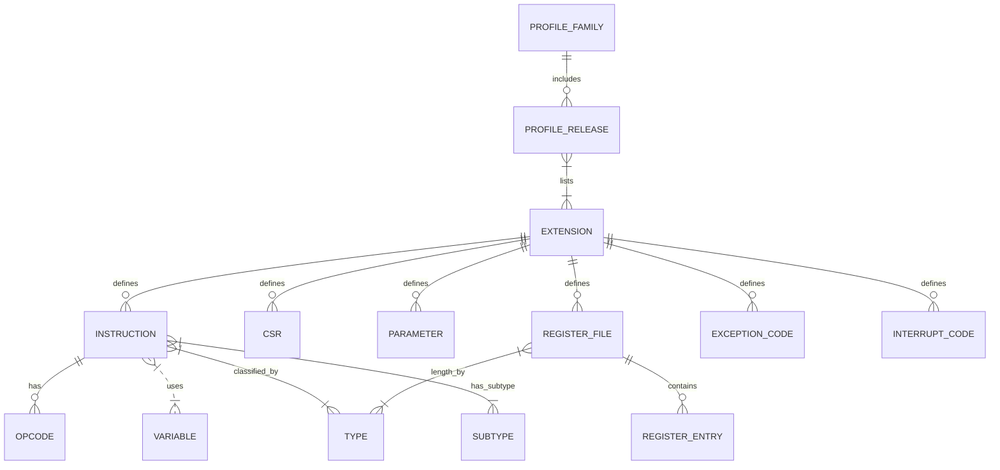

# RISCV-UnifiedDB YAML Structure

The **riscv-unified-db** (UnifiedDB) repository is a monorepo containing a machine-readable database of the entire RISC-V specification.  The data is stored in **YAML** files (one file per extension, instruction, CSR, parameter, etc.) and each file is validated against a corresponding **JSON Schema**.  Key schema files live under `spec/schemas/` (e.g. `ext_schema.json`, `inst_schema.json`, `csr_schema.json`, etc.), and the actual data files are under `spec/std/isa/` (for standard RISC-V) and `spec/custom/isa/` (for custom extensions).  Common YAML templates and examples are documented in `doc/data-templates.adoc`.  In practice, each YAML begins with a header like: 

```yaml
$schema: "<schema>.json#"
kind: <object-type>
name: <unique-name>
```

For example, extensions use `ext_schema.json#` and `kind: extension`.  Each schema (extension, instruction, CSR, parameter, etc.) defines required and optional fields.  Validation is enforced by JSON schemas (using `pre-commit check-jsonschema`) and custom Ruby code; the schemas specify field types, required properties, and conditional rules.  For instance, the CSR schema requires `address`, `writable`, `priv_mode`, etc. and disallows unknown fields. 

Below I document the top-level schema directories/files, enumerate fields for each major entity (extensions, instructions, CSRs, parameters), and show canonical YAML snippets. 

## Top-Level Structure

Relevant top-level directories/files include:

- **`spec/schemas/`** – JSON Schema definitions for each YAML type (e.g. `ext_schema.json`, `inst_schema.json`, `csr_schema.json`, `param_schema.json`, etc.).  
- **`spec/std/isa/`** – Standard ISA data. Subdirectories include `ext/` (extensions), `inst/` (instructions, organized by extension), `csr/` (control/status registers), `param/` (configurable parameters), plus others like `register_file/`, `mmr/`, `interrupt_code/`, etc..  
- **`spec/custom/isa/`** – Custom (nonstandard) extensions/instructions in the same layout as `std/isa/`.  
- **`spec/std/non_isa/`** – Non-ISA data (e.g. semihosting).  
- **`doc/`** – Documentation, including **data-templates.adoc** which shows YAML templates and examples.  
- **Build/config directories** – e.g. `cfgs/` (sample configurations), `backends/` (generators), `tools/` (scripts).  The Ruby-powered build system uses a **Rakefile** to provide tasks (e.g. `rake resolved_arch`, `rake schemas`) for generating resolved specs and outputs.  

All YAML data files declare their schema (with `$schema: "XXX_schema.json#"`), and the repository’s CI includes JSON-Schema validation (via `pre-commit run check-jsonschema`) on each file.  This ensures any YAML conforms exactly to the schema: no extra fields (`additionalProperties: false` in schemas) and required fields are present.

## YAML Templates and Examples

The repository’s documentation provides canonical templates for each type of data file.  For example:

- **Extension (in `spec/std/isa/ext/`)** – Fields: `$schema: "ext_schema.json#"`, `kind: extension`, `name`, `long_name`, `type` (privileged/unprivileged), optional `description`, and a `versions:` list.  Example (from data-templates): 
  ```yaml
  $schema: "ext_schema.json#"
  kind: extension
  name: Zexample
  long_name: Example Extension
  description: |
    Brief description of what this extension provides.
  type: unprivileged  # or privileged
  versions:
    - version: "1.0.0"
      state: ratified
      ratification_date: 2024-01
      url: https://example.com/spec
  ```
- **Instruction (in `spec/std/isa/inst/<Ext>/`)** – Fields: `$schema: "inst_schema.json#"`, `kind: instruction`, `name`, `long_name`, `definedBy.extension.name`, `assembly` (syntax string), `encoding` (pattern and `variables`), `access` (permissions for modes `m/s/u/vs/vu`), optional `data_independent_timing`, `operation(): |` (IDL code), etc.  Example: 
  ```yaml
  $schema: "inst_schema.json#"
  kind: instruction
  name: example
  long_name: Example Instruction
  description: |
    Detailed description of what the instruction does.
  definedBy:
    extension:
      name: I   # base integer extension
  assembly: xd, xs1, imm
  encoding:
    match: "-----------------000-----0010011"
    variables:
      - name: imm
        location: 31-20
        sign_extend: true
      - name: xs1
        location: 19-15
      - name: xd
        location: 11-7
  access:
    s: always
    u: always
    vs: always
    vu: always
  data_independent_timing: true
  operation(): |
    X[xd] = X[xs1] + $signed(imm);
  ```
- **CSR (in `spec/std/isa/csr/`)** – Fields: `$schema: "csr_schema.json#"`, `kind: csr`, `name`, `long_name`, `address` (integer), `writable` (true/false), `priv_mode` (enum M/S/U/VS/D), `length` (32/64/MXLEN/etc.), `description`, optional `definedBy.extension.name`, and a `fields:` mapping of subfields.  Example: 
  ```yaml
  $schema: "csr_schema.json#"
  kind: csr
  name: mexample
  long_name: Machine Example CSR
  address: 0x350         # CSR address in hex
  writable: true         # false for RO CSRs
  priv_mode: M           # M, S, U, or VS
  length: MXLEN          # 32,64,SXLEN, etc.
  description: |
    Description of what this CSR controls.
  definedBy:
    extension:
      name: Sm
  fields:
    FIELD_NAME:
      location: 7-4
      description: |
        Description of this field.
      type: RW
      reset_value: 0
  ```
  (Subfields can specify `location_rv32`/`location_rv64` if XLEN-dependent, or functions `type():`, `sw_write()`, or `alias:` for dynamic/aliasing behavior.)

- **Parameter (in `spec/std/isa/param/`)** – Fields: `$schema: "param_schema.json#"`, `kind: parameter`, `name`, `long_name`, `description`, a `schema:` block (itself a JSON-schema fragment describing the value space), and optional `definedBy.extension.name`.  Example: 
  ```yaml
  $schema: param_schema.json#
  kind: parameter
  name: EXAMPLE_PARAM
  long_name: Example Parameter
  description: |
    Description of what this parameter controls.
  schema:
    type: integer
    minimum: 0
    maximum: 64
  definedBy:
    extension:
      name: Zexample
  ```

The **data-templates.adoc** file lists similar templates for other entities (profiles, register files, interrupt codes, etc.) and points to real examples in the repo such as `spec/std/isa/ext/Zicbom.yaml`, `spec/std/isa/inst/I/addi.yaml`, `spec/std/isa/csr/mtvec.yaml`, `spec/std/isa/param/CACHE_BLOCK_SIZE.yaml`.  These can be inspected for concrete usage.

## Schema Fields and Types

Below I enumerate the key schema fields for each main entity, noting type, required/optional, and constraints. (Details are taken from the JSON schemas under `spec/schemas/` and documented in data-templates.)

### Extension (`ext_schema.json`)

| Field          | Type                        | Required | Allowed values / Description                             | Example        |
| -------------- | --------------------------- | -------- | -------------------------------------------------------- | -------------- |
| `$schema`      | string (uri, const)         | Yes      | `"ext_schema.json#"`                                     | –              |
| `kind`         | string (const)              | Yes      | `"extension"`                                            | –              |
| `name`         | string                      | Yes      | Extension short name (e.g. `Zicsr`, uppercase/lowercase mix) | `Sm`, `Zba`   |
| `long_name`    | string                      | No       | Human-readable name                                      | `Machine mode` |
| `description`  | string (text, AsciiDoc)     | No       | Multi-line description                                  | –              |
| `rvi_jira_issue` | string                    | No       | (optional bug-tracker ID)                                | –              |
| `company`      | string (company ID)         | No       | Company identifier (from schema_defs)                    | –              |
| `doc_license`  | string (license ID)         | No       | Documentation license (ref to schema_defs)               | –              |
| `type`         | string (enum)               | No       | `"unprivileged"` or `"privileged"`      | `unprivileged` |
| `requirements` | object (condition AST)      | No       | Boolean expression of required extensions (refs to schema_defs) | –      |
| `versions`     | array of objects            | Yes      | Version history list (at least one entry)               | –              |
| – `version`    | string                     | Yes      | Version string, pattern `^[0-9]+\.[0-9]+\.[0-9]+$`      | `"1.0.0"`      |
| – `state`      | string (enum)              | Yes      | Spec state (`draft`, `ratified`, `frozen`, etc.)        | `ratified`     |
| – `ratification_date` | string (YYYY-MM or null) | Cond. | Required if `state`=ratified; ISO year-month            | `2024-01`      |
| – `release_date`      | string (YYYY-MM or null) | Cond. | Required if nonstandard-released (`prm` extensions)     | –              |
| – `changes`    | array of strings           | No       | List of change-log entries                               | –              |
| – `url`        | string (uri)               | No       | Link to spec document                                    | –              |
| – `contributors` | array of objects         | No       | List of contributors (name/company/email)                | –              |
| – `requirements` | object (condition AST)    | No       | Requirements for this version (condition on extensions)  | –              |
| `$source`      | string (path)               | No       | Internal: source file path                              | –              |

_Notes_: The `versions` array must have at least one entry; if `state: ratified`, a `ratification_date` (and non-null) is required.  The `type` field distinguishes privileged vs. user extensions.  No other properties are allowed (`additionalProperties: false` in JSON schema).

### Instruction (`inst_schema.json`)

| Field           | Type                         | Required | Allowed values / Description                                     | Example          |
| --------------- | ---------------------------- | -------- | --------------------------------------------------------------- | ---------------- |
| `$schema`       | string (uri, const)          | Yes      | `"inst_schema.json#"`                                           | –                |
| `kind`          | string (const)               | Yes      | `"instruction"`                                                 | –                |
| `name`          | string (pattern)             | Yes      | Instruction mnemonic (lowercase, e.g. `addi`, `sll`)            | `addi`           |
| `long_name`     | string                       | Yes      | One-line human-readable name                                     | `Add immediate`  |
| `description`   | string (text, AsciiDoc)      | Yes      | Detailed description                                            | –                |
| `definedBy`     | object (condition AST)       | Yes      | Extension(s) that define this instruction (e.g. `extension.name: I`) | –         |
| `hints`         | array of refs               | No       | List of other instructions using this one as a HINT code point  | –                |
| `access`        | object                      | Yes      | Access permissions for modes. Fields `m/s/u/vs/vu` each `"always"/"sometimes"/"never"` (defaults). Modes absent default to “always”. | e.g. `s: always` |
| `access_detail` | string                      | No       | Extra notes if some mode is “sometimes”                            | –              |
| `assembly`      | string                      | Yes      | Assembly syntax (operands, comma-separated)                      | `xd, xs1, imm`  |
| `encoding`      | object                      | No *     | Encoding pattern and variables.  (See below.)                     | See below      |
| `format`        | object                      | No       | Fully-resolved encoding format (generated field, not in handwritten YAML). | – |
| `pseudoinstructions` | array of objects       | No       | Pseudoinstruction mappings (each with `when` condition and `to` template). | – |
| `data_independent_timing` | boolean           | No       | True if enforced data-independent timing (e.g. for crypto)        | –              |
| `operation()`   | string (IDL code)           | No       | IDL code function implementing the operation     | –              |
| `operation_ast` | object (internal)           | No       | (Internal) AST of `operation()`                                  | –              |
| `$source`       | string (path)               | No       | (Internal) source file path                                      | –              |

_Notes_: Required fields per schema are `$schema, kind, name, long_name, description, definedBy, access, assembly`. The `encoding` field may be given in *old style* (32/48/16-bit match pattern with `variables`) or newer format.  In the current schema, `encoding` is an object which can either follow the old format (`"$defs/old_encoding"`) or be a map for RV32/RV64 (requiring both `RV32` and `RV64` entries).  A simple example of the old format (from templates) is:
```yaml
encoding:
  match: "-----------------000-----0010011"
  variables:
    - name: imm; location: 31-20; sign_extend: true
    - name: xs1; location: 19-15
    - name: xd;  location: 11-7
```
If using vector or multi-XLEN, one can split into `RV32`/`RV64` subobjects.  No extra properties are permitted (`additionalProperties: false`).

### CSR (`csr_schema.json`)

| Field           | Type                           | Required | Notes / Example                                                  |
| --------------- | ------------------------------ | -------- | ---------------------------------------------------------------  |
| `$schema`       | string (uri, const)            | Yes      | `"csr_schema.json#"`                                             |
| `kind`          | string (const)                 | Yes      | `"csr"`                                                          |
| `name`          | string (pattern)               | Yes      | CSR name, usually starting with `m`/`s`/`u` (see schema_defs)      |
| `long_name`     | string                         | No       | One-line description                                             |
| `description`   | string (text)                  | No       | Detailed description                                             |
| `definedBy`     | object (condition AST)         | No       | Extensions that define this CSR                                  |
| `address`       | integer (0–4095)               | Yes      | CSR address (e.g. `0x305`→773 decimal)                           |
| `indirect_address` | integer                    | No       | (for indirect CSR schemes, usually null or omitted)             |
| `indirect_slot` | integer (1–6)                 | Cond.   | Required if `indirect_address` is non-null (slot index)           |
| `writable`      | boolean                        | Yes      | `true` if software-writeable (RW), `false` if read-only           |
| `virtual_address` | number                      | Cond.   | Required if `priv_mode=="VS"` (virtual supervisor mode)          |
| `priv_mode`     | string (enum)                  | Yes      | One of `M, S, U, VS, D`                                          |
| `length`        | integer or string (enum)       | No       | CSR width in bits: 32,64 or `MXLEN`, `SXLEN`, `VSXLEN`, `XLEN`. Defaults to `MXLEN` if omitted. |
| `requires`      | string                         | No       | Alternate form of `definedBy` for single extension               |
| `fields`        | object (map of **field_name** → field-spec) | No | Subfields of this CSR. Each entry is defined by the **csr_field** schema (see below). The key is the field’s name. |
| `sw_read()`     | string                         | No       | Custom read-return behavior (IDL code)                           |
| `sw_read_ast`   | object                         | No       | (Internal) AST of `sw_read()`                                     |
| `$source`       | string                         | No       | (Internal) source file path                                      |

_Subfields (CSR fields)_ – each key under `fields:` must have:

| Subfield key  | Type                      | Required? | Description                                             |
| ------------- | ------------------------- | --------- | -------------------------------------------------------- |
| `name`        | string                    | No        | (Implicit from the key) Name of the subfield            |
| `long_name`   | string                    | No        | Short description                                       |
| `location`    | string (bit range)        | *Either this or `location_rv32`/`location_rv64` required* | Bit positions (e.g. `7-4`)                            |
| `location_rv32` / `location_rv64` | string | Cond.     | If the field position differs for XLEN=32 vs 64. Both required together if used.|
| `description` | string (text)             | **Yes**   | Detailed description of the field        |
| `type`        | string (enum)             | Cond.     | Field type: one of `RO`, `RO-H`, `RW`, `RW-R`, `RW-H`, `RW-RH`. Required unless using `type()` below. |
| `type()`      | string (IDL code)         | Cond.     | If field type depends on config.  Must return a `CsrFieldType`. Required if `type` omitted. |
| `reset_value` | integer or `"UNDEFINED_LEGAL"` | Cond. | Reset value. Must be integer in an actual implementation. Required unless using `reset_value()`. |
| `reset_value()` | string (IDL code)       | Cond.     | Config-dependent reset value.  Required if `reset_value` omitted. |
| `alias`       | string or array           | No        | If this field aliases another CSR’s field(s), specify `REG.FIELD` (or array). |
| `definedBy`   | object (condition AST)    | No        | If this field only exists under certain extension conditions (default inherits parent CSR’s condition). |
| `affectedBy`  | string or array          | No        | Extensions that further affect the field definition.      |

The CSR schema enforces that **exactly one** of (`location` or both `location_rv32`+`location_rv64`) is present, and one of (`type` or `type()`) is present, and one of (`reset_value` or `reset_value()`) is present.  Common types (`RW`, etc.) are documented in data-templates.  Example (from schema and templates) for a 64-bit-only field:
```yaml
fields:
  BASE:
    location_rv64: 63-2
    location_rv32: 31-2
    description: Base address field.
    type: RW
    reset_value: 0
```

### Parameter (`param_schema.json`)

| Field         | Type                          | Required | Description / Notes                      | Example |
| ------------- | ----------------------------- | -------- | ---------------------------------------- | ------- |
| `$schema`     | string (const)                | Yes      | `"param_schema.json#"`                   | –       |
| `kind`        | string (const)                | Yes      | `"parameter"`                            | –       |
| `name`        | string                        | Yes      | Parameter name (e.g. `CACHE_BLOCK_SIZE`) | `CACHE_BLOCK_SIZE` |
| `long_name`   | string                        | Yes      | Short human name                        | –       |
| `description` | string (text)                 | Yes      | Description of parameter                | –       |
| `definedBy`   | object (condition AST)        | Yes      | Extensions requiring this parameter      | –       |
| `schema`      | object (JSON schema fragment) | Yes      | JSON Schema specifying allowed values   | e.g. `{type: integer, minimum:1, maximum:1024}` |
| `requirements`| object (condition AST)        | No       | Additional condition to exist           | –       |
| `$source`     | string                        | No       | (Internal) source path                  | –       |

The `schema` block embeds a JSON Schema fragment (Draft-07) defining the value.  For example, an enum parameter might have 
```yaml
schema:
  type: string
  enum: ["option1", "option2", "option3"]
``` 
as shown in data-templates.  Allowed types include integer, boolean, string, array, etc.  All required fields must appear and no extraneous fields are allowed.

### Other Entities

- **Register File (`register_file_schema.json`)** – Describes a register file (e.g. vector registers). Key fields: `kind: register_file`, `name`, `long_name`, `description`, `definedBy`, `register_class` (one of `general_purpose`/`floating_point`/`vector`), a function `register_length()` giving width in bits, and `registers` (array of register entries).  Each register entry has `name` (required), optional `abi_mnemonics` (aliases), `description`, caller-saved, callee-saved flags, etc..

- **MMR (Memory-Mapped Register)** – Similar in structure to a CSR but for memory-mapped CSR-like registers. Follows `mmr_schema.json`. Not detailed here.

- **Profile, Profile Family, Profile Release** – Define standard sets of extensions.  `profile_schema.json` links extensions into profiles; `profile_family` and `profile_release` schemas tie together multiple profiles (for RVI/RVA/RVB specifications).  These refer to extension names and versions; see schemas.  (Example: a profile might list extension names it includes.)

- **Others** – `exception_code_schema.json`, `interrupt_code_schema.json` define exception/interrupt codes; `inst_type_schema.json` and `inst_subtype_schema.json` define taxonomy of instruction types and subtypes; these are relatively static lookup tables (patterned after official names like `I`, `MOP_1`, etc.).

## Validation and Tooling

**JSON Schema** is the primary validator.  Every YAML file is checked against its schema on each CI build (via `pre-commit run check-jsonschema`).  The schemas use `additionalProperties: false` universally, so unknown fields cause errors.  They also encode conditional logic.  For example, the CSR schema enforces the presence of `indirect_slot` if `indirect_address` is used.  Similarly, instruction schema requires either a flat 32-bit `encoding.match` or split RV32/RV64 encodings.  The extension schema uses `if: then:` clauses to require `ratification_date` if `state == ratified` (and similarly for `nonstandard-released`/`release_date`).

Beyond JSON Schema, the repository includes Ruby code for further validation and usage.  For instance, the Rakefile (and underlying Ruby classes in `lib/udb/`) defines tasks like **`rake resolved_arch`** to apply configuration overlays to the spec, and **`rake schemas`** to emit fully-resolved JSON schemas.  There is also an `udb` Ruby gem with classes (e.g. `ArchDef`) to query the merged database.  However, structural correctness is mostly handled by the JSON schemas and pre-commit hooks.

Common issues and clarifications (from repo discussions and docs):

- **Field Aliases**: The CSR schema allows a `alias` key to indicate an alias to another CSR’s field; the YAML should use syntax like `alias: mcycle.COUNT`.
- **Modes and Privileges**: The `access` and `priv_mode` fields use fixed enums (`"always/sometimes/never"` and `"M/S/U/VS"`).  In instruction YAML, only `s/u/vs/vu` must be given; `m` defaults to “always” if omitted (as per schema).
- **Encoding Variants**: Legacy encodings (13/16/48-bit) are supported via the `encoding.match` patterns in inst-schema (see schema `$defs.old_encoding`).  Newer style can use `format` or split encodings by XLEN.
- **RV32/RV64 Differences**: Many schemas allow separate RV32/RV64 specs.  For example, CSRs can specify `location_rv32`/`location_rv64` and instructions can have different encodings.  The data-templates show example of CSR field with separate locations.

## Entity-Relationship Diagram

Below is a conceptual ER diagram of the main entities and their relationships (modeled in Mermaid notation). Entities include Extensions, Instructions, CSRs, Parameters, RegisterFiles, etc., and how they link (an **example**; see [33] and [71]):



*Diagram notes*: An **Extension** can define many Instructions, CSRs, Parameters, and Register Files (for privileged groups).  Each Instruction belongs to an Extension (`definedBy`) and references operand variables (`inst_var`) and opcodes.  Instructions are classified by an *inst_type* and optionally an *inst_subtype*.  CSRs are grouped into register files under each extension.  Profiles and profile-releases aggregate lists of extensions.

*(Because this is an example, see the actual repo structures or the RISCV “Profile & Extensions” sheet for details.)*

## Representative YAML Patterns

Here are annotated YAML snippets (citing data-templates) showing common patterns:

- **Extension snippet**:
  ```yaml
  $schema: "ext_schema.json#"
  kind: extension
  name: Zexample
  long_name: Example Extension
  description: |
    Brief description of this extension...
  type: unprivileged  # or privileged
  versions:
    - version: "1.0.0"
      state: ratified
      ratification_date: 2024-01
  ```
- **Instruction snippet**:
  ```yaml
  $schema: "inst_schema.json#"
  kind: instruction
  name: example
  long_name: Example Instruction
  description: |
    Detailed description of what the instruction does.
  definedBy:
    extension:
      name: I       # defines integer base ISA
  assembly: xd, xs1, imm
  encoding:
    match: "-----------------000-----0010011"
    variables:
      - name: imm
        location: 31-20
        sign_extend: true
      - name: xs1
        location: 19-15
      - name: xd
        location: 11-7
  access:
    s: always
    u: always
    vs: always
    vu: always
  operation(): |
    X[xd] = X[xs1] + $signed(imm);
  ```
- **CSR snippet**:
  ```yaml
  $schema: "csr_schema.json#"
  kind: csr
  name: mexample
  long_name: Machine Example CSR
  address: 0x350
  writable: true
  priv_mode: M
  length: MXLEN
  description: |
    Description of what this CSR controls.
  definedBy:
    extension:
      name: Sm
  fields:
    FIELD_NAME:
      location: 7-4
      description: |
        Description of this field.
      type: RW
      reset_value: 0
  ```
- **Parameter snippet**:
  ```yaml
  $schema: param_schema.json#
  kind: parameter
  name: EXAMPLE_PARAM
  long_name: Example Parameter
  description: |
    Controls the size of the example cache block.
  schema:
    type: integer
    minimum: 0
    maximum: 64
  definedBy:
    extension:
      name: Zexample
  ```

These examples illustrate required fields (`$schema`, `kind`, `name`, etc.) and how optional data (multiline descriptions, lists, maps) are structured.  For instance, note that `encoding.variables` is a YAML list of objects, while `fields` in CSR is a YAML map of named fields.

## Variations and Legacy Notes

- **Old vs New Encodings**: The instruction schema supports both the “old” flat encoding (32/48/16-bit `match` with one `variables` list) and a new split format using `RV32`/`RV64` sub-objects.  Existing YAML mostly uses the old style (as in the template) but new encodings (especially for vector instructions) may use the `format` or split form.
- **RV32/RV64 Differences**: Many definitions allow specifying separate layouts for RV32 vs RV64.  The data-templates show CSR fields with both `location_rv32` and `location_rv64`; the schema enforces either a single `location` (XLEN-agnostic) or both `location_rv32`+`location_rv64`.
- **Configuration-Dependent Fields**: Some fields can be functions of config (using `()`).  E.g., CSR field `type():` or `reset_value():` can contain IDL code to choose type/reset based on parameters.  These appear as string fields in YAML but their schema entries (`type()` and `reset_value()`) are also type `string`, and schema requires either the static or function form.
- **Aliases**: CSR fields and register fields support an `alias:` key to alias another register’s field.  The YAML uses a dotted name (e.g. `alias: otherCSR.FIELD`) while the schema allows mapping or lists.

No major *legacy YAML formats* exist beyond these; the repository evolved to use consistent schemas.  All data files include the `$schema:` line, so migrating to a new schema version simply means changing that pointer (the resolvers in Rake copy `$schema` to fully-qualified URLs in `gen/schemas`).

## Tools and Commands

Key tools and commands in the repo include:

- **JSON-Schema Validation** – As noted, the `pre-commit` hook uses [python-jsonschema/check-jsonschema](https://github.com/python-jsonschema/check-jsonschema) to validate all `spec/std/isa/` YAML files against their schemas.  This is also done in CI.
- **Rakefile Tasks** – The repository uses Ruby/Rake for processing.  Notable tasks:
  - `rake resolved_arch CFG=<name>` – Apply a config (from `cfgs/`) to the standard spec, producing implementation-specific YAML under `gen/resolved_arch/`.
  - `rake schemas` – Write out the “resolved” JSON schemas (with full `$id` URIs) to `gen/schemas/`.
  - Other tasks generate documentation, instruction appendices, etc.
- **Ruby API** – The `udb` Ruby gem (in `lib/udb/`) provides classes to load and query the YAML database.  For example, one can call `ArchDef.new` to access extensions, instructions, etc. (not detailed here).
- **`do` Script** – A wrapper script (`bin/do`) likely invokes Rake in a cleaned environment (as hinted by docs).
- **IDL Compiler** – The Rake tasks may invoke an IDL compiler (`Idl::Compiler`) to process IDL code into YAML/Ast.

These tools automate generation of specs from the raw YAML data.  Example usage: `rake resolved_arch CFG=rv64` would generate RV64-specific YAML, then one could produce HTML/PDF docs from that.

## References

- UnifiedDB repository README and doc: contains descriptions of structure and links to schemas.  
- `doc/data-templates.adoc`: provides canonical YAML templates and examples.  
- JSON Schema files in `spec/schemas/`: authoritative definition of all fields (cited above for extension, instruction, CSR, parameter).  
- Issues/PRs: e.g. PR templates and issue discussions clarify some schema choices (not exhaustively listed here).  
- Continuous docs: [UnifiedDB Deployment Artifacts](https://riscv.github.io/riscv-unified-db/) lists all schema files and gives examples (I cited from it for raw schemas).

Together these describe the full YAML structure of UnifiedDB’s database. Each file’s exact format is governed by its schema, ensuring consistency across the repository.
