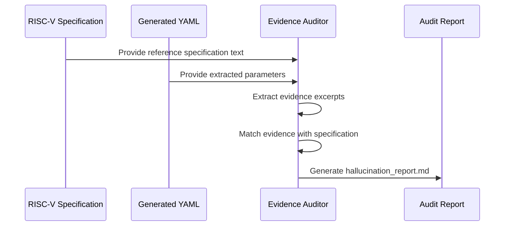

# Evidence Audit & Hallucination Detection

## Overview

The **Evidence Audit** module is a verification layer in the **RISC-V Architectural Parameters Extraction** pipeline.

Large Language Models (LLMs) are capable of extracting useful architectural information from technical specifications, but they can also produce unsupported claims, incorrect parameters, or fabricated evidence.

This module addresses this problem by auditing every extracted parameter against the original RISC-V specification text.

The goal is to ensure that every generated architectural parameter is backed by real specification evidence.

---

# Role in Overall Pipeline

```mermaid
flowchart LR

    A[RISC-V Specification<br/>PDF/Text]

    B[Text Processing]

    C[Candidate Detection<br/>candidate_detector.py]

    D[LLM Extraction]

    E[Generated YAML<br/>Architectural Parameters]

    F[Evidence Auditor<br/>evidence_auditor.py]

    G[Model Comparison<br/>compare.py]

    H[Ground Truth Evaluation<br/>evaluate.py]


    A --> B
    B --> C
    C --> D
    D --> E
    E --> F
    F --> G
    G --> H
````

---

# Why Evidence Auditing?

LLM-based extraction systems may suffer from hallucination, where models generate information that is:

* Not present in the specification
* Incorrectly interpreted
* Based on assumptions
* Missing supporting evidence

For technical domains such as RISC-V ISA specifications, unsupported information can lead to incorrect architectural parameter databases.

The Evidence Auditor provides an automated verification mechanism before extracted results are accepted.

---

# Hallucination Detection Workflow

```mermaid
flowchart TD

    A[Original RISC-V Specification]

    B[LLM Generated YAML]

    C[Extract Parameters]

    D[Extract Evidence / Excerpt]

    E[Compare Evidence<br/>Against Specification]

    F{Evidence Supported?}

    G[PASS<br/>Valid Extraction]

    H[FAIL<br/>Possible Hallucination]


    A --> E

    B --> C

    C --> D

    D --> E

    E --> F

    F -->|Yes| G

    F -->|No| H
```

---

# How It Works

The auditor takes two inputs:

## 1. Original Specification Text

The original RISC-V specification snippets are used as the source of truth.

Example:

```
snippets/
├── priveleged_19.3.1.txt
└── priveleged_2.1.txt
```

These files contain the specification sections from which architectural parameters are extracted.

---

## 2. LLM Generated YAML

Each model-generated YAML file is checked against the specification.

Example:

```
results/
└── priveleged_19.3.1/
    └── GPT-5.5/
        └── v4/
            └── run1/
                └── extracted_parameters.yaml
```

The auditor verifies whether the extracted parameter evidence exists in the original specification.

---

# Audit Process



---

# Verification Strategy

For every extracted parameter, the auditor checks:

## Evidence Presence

Does the provided excerpt exist in the original specification?

Example:

Specification:

```
The size of a cache block is implementation-specific.
```

Generated YAML:

```yaml
name: cache_block_size

excerpt: "The size of a cache block is implementation-specific."
```

Result:

```
PASS
```

---

## Unsupported Claims

Example:

Generated YAML:

```yaml
name: cache_color

excerpt: "Cache color size is configurable."
```

If this information is not present in the specification:

```
FAIL
```

The parameter is flagged as a possible hallucination.

---

# Output Structure

```
audits/
│
├── README.md
│
├── priveleged_19.3.1/
│   │
│   ├── README.md
│   │
│   ├── Claude_Sonnet_5/
│   │   └── hallucination_report.md
│   │
│   ├── DeepSeek_V4-Flash-0731/
│   │   └── hallucination_report.md
│   │
│   ├── Gemini_3/
│   │   └── hallucination_report.md
│   │
│   ├── GPT-5.5/
│   │   └── hallucination_report.md
│   │
│   └── ...
│
└── priveleged_2.1/
    │
    ├── README.md
    │
    ├── GPT-5.5/
    │   └── hallucination_report.md
    │
    └── ...
```

---

# Supported Models

The auditor evaluates extraction results from:

* Claude_Sonnet_5
* DeepSeek_V4-Flash-0731
* Gemini_3
* Gemini_3.6_Flash
* GLM-5.2
* GPT-5.5
* Ising-Calibration-1.5
* K2.6
* Mistral_Medium_3.5
* Proprietary_Microsoft_Build
* Qwen
* Sonar-Perplexity

---

# Report Format

Each model receives its own:

```
hallucination_report.md
```

Example:

```markdown
| Parameter | Evidence Found | Similarity | Status |
|---|---|---|---|
| cache_block_size | True | 1.0 | PASS |
| cache_size | False | 0.18 | FAIL |
```

---

# Report Interpretation

| Status | Meaning                                          |
| ------ | ------------------------------------------------ |
| PASS   | Parameter is supported by specification evidence |
| FAIL   | Parameter may be hallucinated or unsupported     |

---

# Running the Auditor

From the repository root:

```bash
python scripts/evidence_auditor.py
```

The script automatically:

1. Reads available specification snippets.
2. Finds available model extraction outputs.
3. Audits extracted evidence.
4. Generates hallucination reports.

---

# Complete Reliability Pipeline


---

# Purpose

The Evidence Auditor ensures that automated RISC-V architectural parameter extraction remains:

* Evidence-based
* Reproducible
* Auditable
* Resistant to hallucinations

