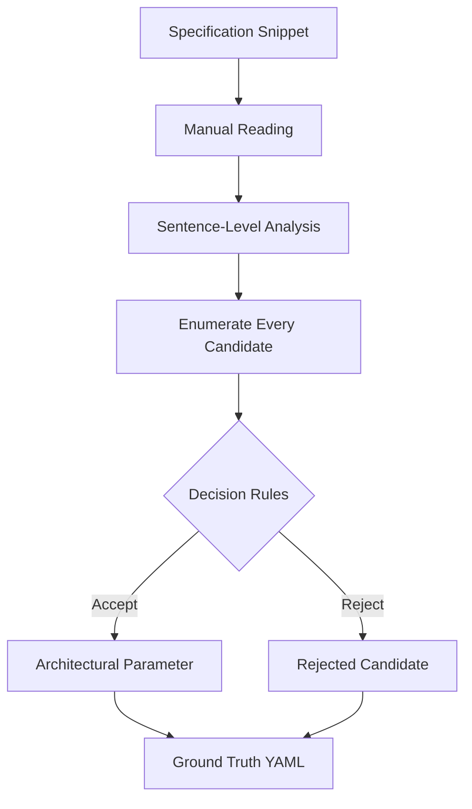
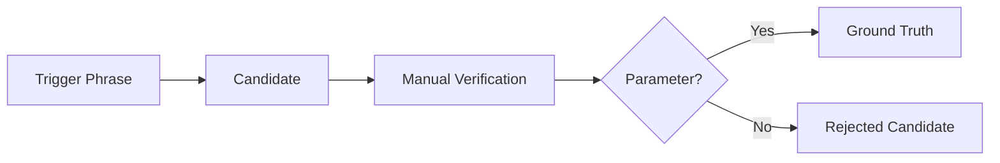
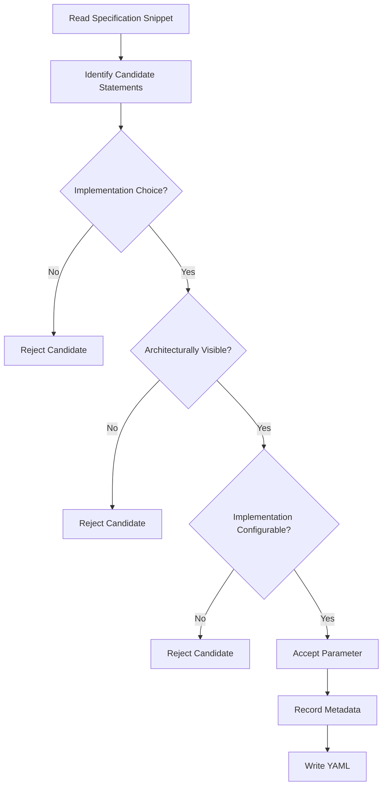
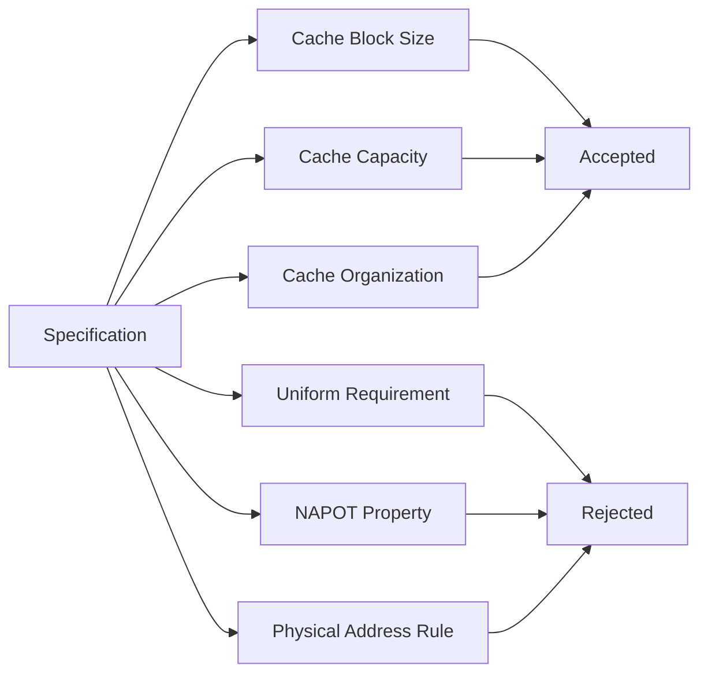
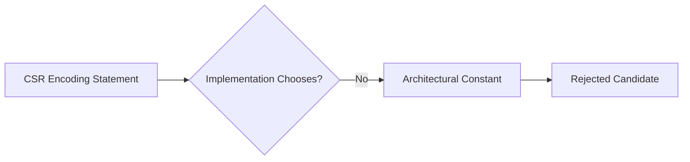
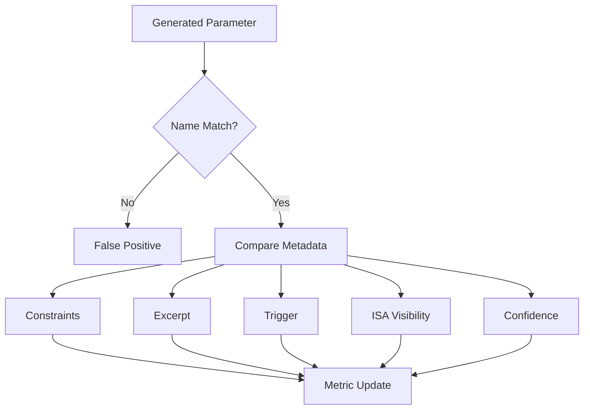
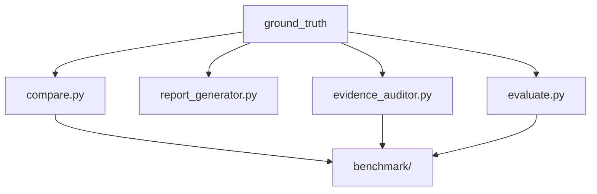

# Ground Truth

> **Purpose:** Establish a manually verified reference (Gold Standard) for evaluating Large Language Models (LLMs) on the task of extracting architectural parameters from the RISC-V ISA specification.

---

# 1. Introduction

The objective of this repository is **not** to determine whether an LLM understands RISC-V in general.

Instead, it evaluates whether an LLM can accurately identify **architectural parameters that are explicitly supported by a given specification snippet**, distinguish them from descriptive text and architectural constants, and justify every extracted parameter using evidence from the source document.

To perform this evaluation objectively, every generated extraction must be compared against a manually curated reference.

That reference is the **Ground Truth**.

Unlike model outputs, the Ground Truth is produced entirely through manual analysis of the specification text before benchmarking. It serves as the authoritative baseline used by the evaluation pipeline and remains fixed across all experiments, ensuring that different prompts and language models are measured against the same standard.

---

# 2. Repository Context

The Ground Truth is one component of the complete extraction and benchmarking pipeline.


The Ground Truth therefore represents the central reference used throughout the repository.

Every benchmark metric—including precision, recall, constraint accuracy, and hallucination rate—is computed relative to these manually verified files.

---

# 3. Purpose of the Ground Truth

Language models frequently produce outputs that appear plausible while containing unsupported assumptions or information derived from prior training rather than the supplied specification.

Common failure modes include:

| Failure Mode             | Example                                                                       |
| ------------------------ | ----------------------------------------------------------------------------- |
| Over-extraction          | Treating descriptive text as a parameter                                      |
| Hallucination            | Inventing constraints not present in the snippet                              |
| Prior Knowledge Leakage  | Using information from other ISA chapters or UDB                              |
| Incorrect Classification | Treating architectural constants as configurable parameters                   |
| Unsupported Constraints  | Adding numeric limits or implementation details absent from the specification |

A manually curated Ground Truth eliminates ambiguity by defining exactly which candidates should be accepted and which should be rejected.

---

# 4. Ground Truth Philosophy

The Ground Truth follows a deliberately conservative philosophy.

> **Only information explicitly supported by the provided specification snippet is accepted.**

Information is **not accepted** merely because:

* it is true elsewhere in the RISC-V ISA,
* it appears in UnifiedDB,
* it is common architectural knowledge,
* or it is known by the language model.

Consequently, a model may produce technically correct information that is still considered **ungrounded** if it cannot be justified from the supplied text.

This benchmark therefore measures **grounded specification understanding**, not memorized architectural knowledge.

---

# 5. Ground Truth Construction Workflow

Each specification snippet undergoes the same manual analysis procedure.



Unlike automated extraction, the objective is **not to maximize the number of parameters**.

Instead, the objective is to determine which candidates remain valid after rigorous manual verification.

---

# 6. Benchmark Workflow

The complete benchmarking process implemented in this repository is shown below.


Each stage has a distinct responsibility.

| Stage                   | Responsibility                             |
| ----------------------- | ------------------------------------------ |
| Extraction              | Generate structured YAML                   |
| Validation              | Verify schema correctness                  |
| Evidence Audit          | Confirm supporting evidence exists         |
| Ground Truth Comparison | Compare against manually curated benchmark |
| Evaluation              | Compute quantitative metrics               |
| Reporting               | Produce benchmark summaries                |

---

# 7. Specifications Used

The current benchmark evaluates two excerpts from the RISC-V ISA.

| Specification          | Primary Topic                     | Expected Difficulty     |
| ---------------------- | --------------------------------- | ----------------------- |
| Privileged Spec 19.3.1 | Cache Management Operations (CMO) | Medium                  |
| Privileged Spec 2.1    | CSR Address Encoding              | High (Negative Control) |

Although both snippets appear to contain implementation-related language, they present fundamentally different extraction challenges.

The first snippet contains implementation-defined cache properties.

The second primarily describes architectural encoding rules rather than configurable implementation parameters.

This distinction allows the benchmark to evaluate both **parameter extraction** and **false-positive resistance**.

---

# 8. Trigger-Based Candidate Discovery

The extraction methodology begins by identifying textual signals that may indicate implementation freedom.

Typical trigger phrases include:

| Trigger                 | Interpretation                           |
| ----------------------- | ---------------------------------------- |
| implementation-specific | Implementation chooses the value         |
| implementation-defined  | Implementation chooses the value         |
| optional                | Feature may exist                        |
| optionally              | Optional behavior                        |
| may                     | Implementation freedom or recommendation |
| might                   | Possible implementation behavior         |
| should                  | Recommendation (not mandatory)           |

The presence of a trigger **does not automatically imply** that a parameter exists.

Instead, it simply marks a candidate for further evaluation.



This distinction is essential because specification language frequently uses implementation-related wording while describing architectural constants, mandatory constraints, or explanatory text rather than configurable parameters.

---

# 9. Decision Philosophy

Every candidate identified during manual analysis is evaluated independently.

The benchmark intentionally favors **precision over recall**.

Extracting one unsupported parameter is considered more harmful than failing to extract a genuinely ambiguous candidate.

Consequently, every accepted parameter must satisfy all verification criteria described in the following sections.

The next section presents the formal decision rules together with the complete adjudication process for each specification snippet.

---

## 10. Ground Truth Development Workflow

The gold-standard annotations were created using a deterministic review process rather than iterative prompt engineering. Every candidate passes through the same sequence of checks before being accepted or rejected.



Every accepted parameter includes:

| Field | Purpose |
|--------|----------|
| name | Canonical parameter name |
| long_name | Human readable description |
| description | Semantic meaning |
| type | Data type or architectural class |
| constraints | Properties explicitly stated in the specification |
| excerpt | Exact supporting text |
| trigger | Phrase responsible for extraction |
| defined_by | Source specification |
| isa_visible | Whether software can observe the parameter |
| confidence | Annotation confidence |

Rejected candidates are also preserved because false positives are important when evaluating extraction quality.

---

#  Ground Truth for Privileged Spec 19.3.1

## Source

```
Caches organize copies of data into cache blocks...

...

The capacity and organization of a cache and the size of a cache block are both implementation-specific...

...

The execution environment provides software a means to discover information...

...

The size of a cache block shall be uniform throughout the system.
```

---

## Candidate Analysis

The specification mentions several implementation-dependent concepts.

However, implementation dependence alone does **not** imply an architectural parameter.

The following candidate space was evaluated.

| Candidate | Implementation Defined | ISA Visible | Final Decision |
|------------|-----------------------|-------------|----------------|
| Cache Block Size | ✅ | ✅ | Accept |
| Cache Capacity | ✅ | Partial | Accept |
| Cache Organization | ✅ | Partial | Accept |
| Uniform Block Size | No | Yes | Reject |
| NAPOT Alignment | No | Yes | Reject |
| Physical Address Identification | No | Yes | Reject |

---

## Accepted Parameters

Three architectural parameters are intentionally included in this benchmark.

| Parameter | Reason |
|-----------|--------|
| Cache Block Size | Explicitly implementation-specific and discoverable |
| Cache Capacity | Implementation-specific cache property |
| Cache Organization | Implementation-specific cache property |

These represent implementation-defined architectural characteristics that software may discover through the execution environment.

---

## Rejected Candidates

Certain specification statements describe architectural rules rather than configurable parameters.

| Candidate | Reason for Rejection |
|-----------|----------------------|
| Uniform Cache Block Size | Constraint on another parameter |
| NAPOT Alignment | Mandatory architectural property |
| Physical Address Mapping | Descriptive behaviour |

These remain documented to measure hallucination rate during evaluation.

---

## Decision Summary



---

#  Ground Truth for Privileged Spec 2.1

Unlike the cache-management snippet, this specification primarily defines architectural encodings.

The passage describes fixed CSR encoding rules rather than implementation-selected architectural parameters.

---

## Source Topics

| Topic | Description |
|--------|-------------|
| CSR Address Width | 12-bit encoding |
| CSR Encoding Space | Up to 4096 CSRs |
| Read/Write Encoding | csr[11:10] |
| Privilege Encoding | csr[9:8] |

---

## Candidate Analysis

| Candidate | Fixed by ISA | Configurable | Decision |
|------------|-------------|--------------|----------|
| CSR Address Width | ✅ | ❌ | Reject |
| Maximum CSR Count | ✅ | ❌ | Reject |
| CSR Accessibility Encoding | ✅ | ❌ | Reject |
| Read/Write Encoding | ✅ | ❌ | Reject |
| Privilege Encoding | ✅ | ❌ | Reject |

No implementation-configurable architectural parameters are introduced in this snippet.

Therefore the expected parameter count is **zero**.

---

## Decision Flow



---

## Expected Benchmark Output

| Snippet | Expected Parameters | Expected Rejections |
|----------|--------------------|---------------------|
| Privileged Spec 19.3.1 | 3 | 3 |
| Privileged Spec 2.1 | 0 | 5 |

The benchmark therefore evaluates both:

- Correct parameter extraction.
- Correct rejection of architectural constants.

---

#  Evaluation Strategy

The purpose of the ground truth is not only to verify that a model extracts valid parameters, but also to determine **why** a prediction succeeds or fails. Evaluation is therefore performed at both the parameter level and the metadata level.

## Evaluation Pipeline


The evaluation compares each generated YAML against the manually curated gold standard.

---

## Evaluation Metrics

| Metric | Description |
|---------|-------------|
| Precision | Percentage of extracted parameters that are correct. |
| Recall | Percentage of ground-truth parameters successfully extracted. |
| F1 Score | Harmonic mean of Precision and Recall. |
| Constraint Accuracy | Percentage of constraints correctly reproduced. |
| Metadata Accuracy | Accuracy of description, trigger, excerpt, confidence, and ISA visibility fields. |
| Hallucination Rate | Percentage of parameters unsupported by the specification text. |
| Evidence Coverage | Percentage of extracted parameters with valid supporting excerpts. |
| Validation Pass Rate | Percentage of YAML files passing schema validation. |

---

## Matching Strategy

Each extracted parameter is matched against the ground truth using its canonical parameter name.



---

## Hallucination Detection

Hallucinations are identified through the evidence auditing stage.

A parameter is considered hallucinated if:

- it is absent from the ground truth,
- it cannot be supported by the provided specification excerpt,
- or its supporting evidence does not appear in the original snippet.

This repository intentionally stores hallucination reports separately under:

```
audits/
```

Those reports are automatically summarized by `report_generator.py`.

---

#  Repository Integration

The Ground Truth directory works together with the remaining pipeline.



---

## Pipeline Overview

| Script | Purpose |
|----------|---------|
| extract.py | Extract candidate architectural parameters |
| validate.py | Validate generated YAML format |
| compare.py | Compare outputs across prompts and models |
| candidate_detector.py | Detect implementation-related candidate phrases |
| riscv_candidate_detector.py | Detect RISC-V specific architectural candidates |
| evidence_auditor.py | Verify supporting excerpts and detect hallucinations |
| evaluate.py | Compare generated YAML against Ground Truth |
| report_generator.py | Produce benchmark summaries and leaderboard |

---

# Design Principles

The Ground Truth follows several guiding principles.

| Principle | Explanation |
|------------|-------------|
| Deterministic | The same snippet always produces the same annotation. |
| Reproducible | Results do not depend on the model used. |
| Explainable | Every decision includes supporting evidence. |
| Traceable | Every parameter maps back to an exact specification excerpt. |
| Conservative | Unsupported assumptions are never introduced. |
| ISA-Centric | Parameters are extracted from architectural behaviour rather than implementation guesses. |

---

# 13. Summary

This directory represents the **reference benchmark** for architectural parameter extraction.

Unlike generated model outputs, these files are manually curated and serve as the authoritative source for evaluation. Every benchmark result, hallucination analysis, precision score, recall score, and comparison report generated within this repository ultimately depends on these annotations.

By separating the immutable Ground Truth from generated outputs, the repository provides a transparent, reproducible, and model-independent framework for evaluating Large Language Models on the task of extracting architectural parameters from RISC-V ISA specifications.