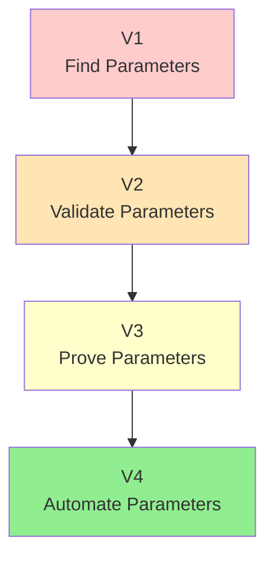
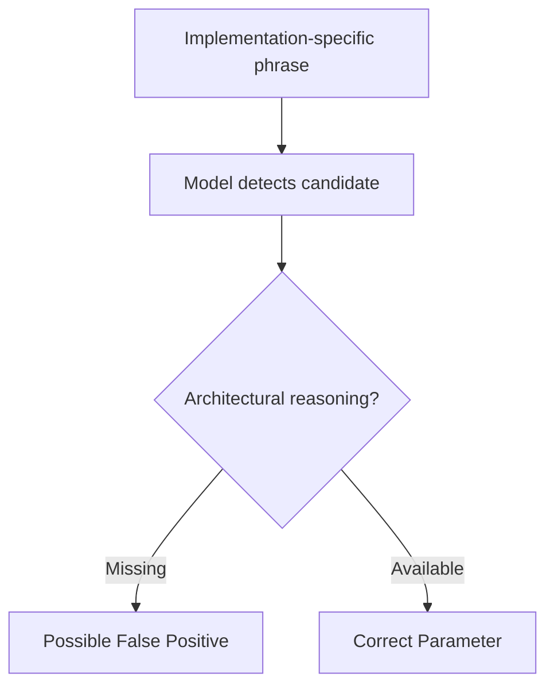
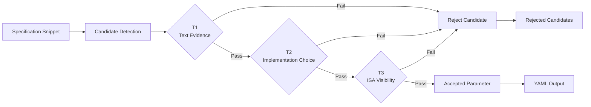
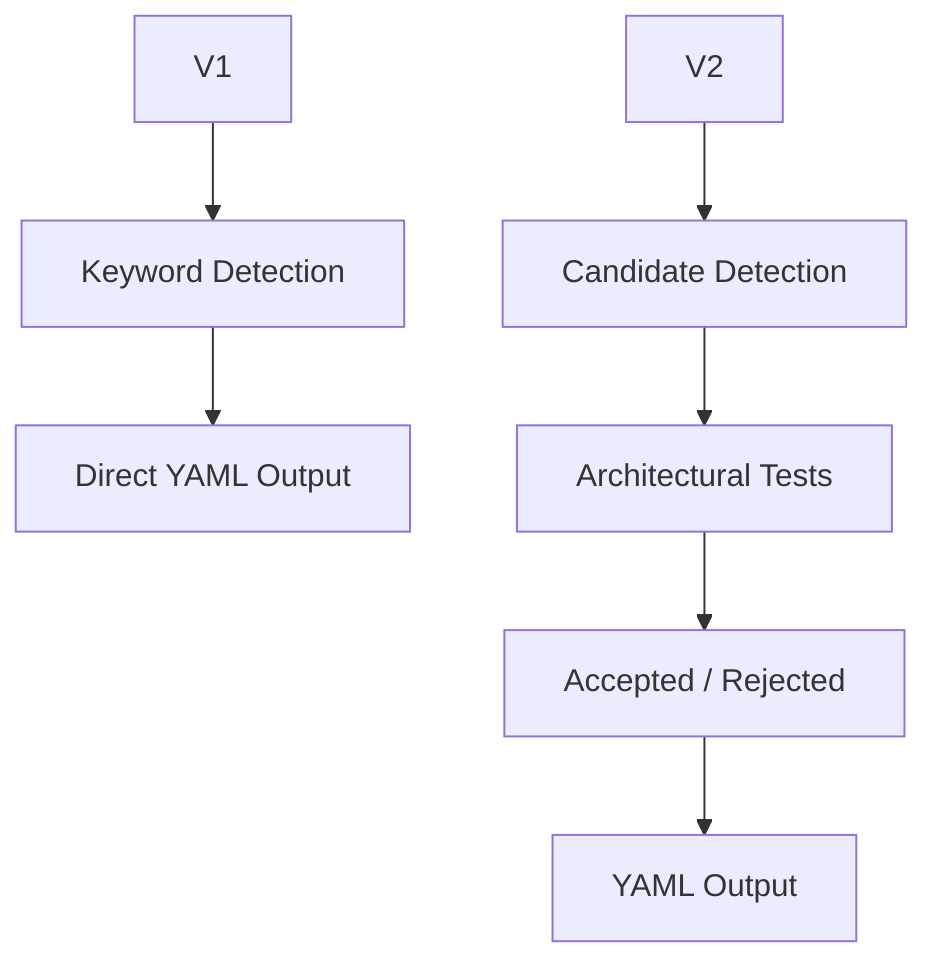
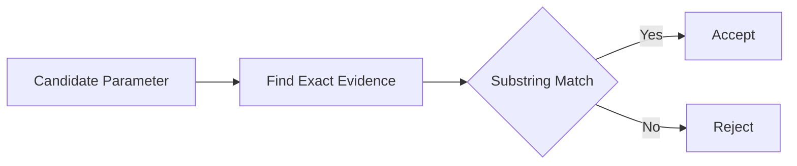
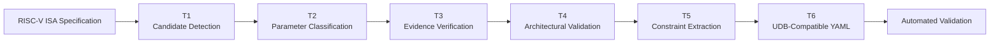
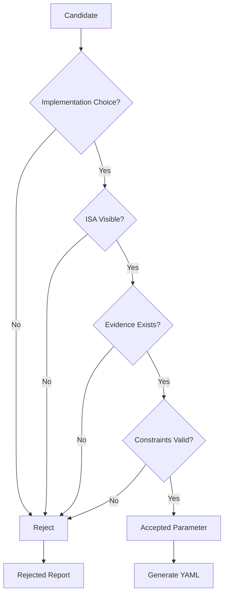
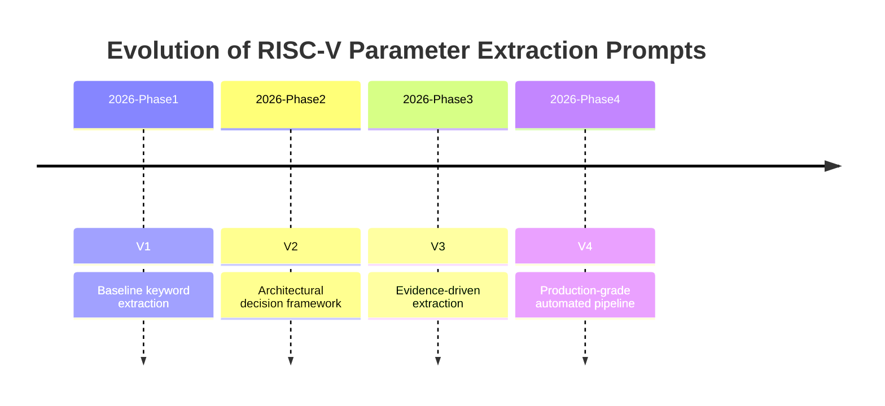

# Prompt Version Comparison

## Overview

This document describes the evolution of prompt engineering strategies used for
RISC-V architectural parameter extraction.

The objective of this benchmark was not only to extract possible parameters from
ISA specification text, but to progressively improve:

- extraction precision
- architectural correctness
- evidence grounding
- hallucination resistance
- reproducibility
- compatibility with automated validation pipelines

Four prompt versions were developed:

| Version | Name | Main Objective |
|---------|------|----------------|
| V1 | Baseline Extraction | Establish simple parameter extraction |
| V2 | Decision-Based Extraction | Introduce architectural validation rules |
| V3 | Evidence-Driven Extraction | Add evidence grounding and traceability |
| V4 | Production Extraction Pipeline | Combine all validation stages into a complete workflow |

---

# Prompt Evolution

The prompt design evolved from a simple extraction approach into a
multi-stage architectural analysis pipeline.

```mermaid
flowchart LR

A["V1<br/>Baseline Extraction<br/><br/>Keyword Based"]
--> 
B["V2<br/>Decision Framework<br/><br/>T1-T3 Validation"]

B 
-->
C["V3<br/>Evidence Driven<br/><br/>Grounded Extraction"]

C
-->
D["V4<br/>Production Pipeline<br/><br/>Complete Validation Workflow"]

style D fill:#90EE90
````

---

# Design Philosophy

Early prompt versions focused on **finding possible parameters**.

However, architectural specifications contain many values that look like
parameters but are actually:

* architectural constants
* mandatory constraints
* descriptive information
* microarchitectural implementation details

Therefore, later versions introduced stronger filtering mechanisms.

The final workflow follows:

```mermaid
flowchart TD

A["Specification Text"]

A --> B["Candidate Discovery"]

B --> C["Architectural Reasoning"]

C --> D["Evidence Verification"]

D --> E["Constraint Validation"]

E --> F["Structured YAML Output"]

F --> G["Benchmark Evaluation"]
```

---

# Prompt Development Strategy

Each version introduced a specific improvement.

| Version | Problem Addressed                                          | Solution Introduced          |
| ------- | ---------------------------------------------------------- | ---------------------------- |
| V1      | Simple extraction produced unsupported candidates          | Baseline extraction rules    |
| V2      | Models confused parameters with constants and descriptions | Architectural decision tests |
| V3      | Correct reasoning could still produce unsupported outputs  | Exact evidence requirement   |
| V4      | Multiple validation steps needed automation                | Complete production workflow |

---

# Capability Growth

| Capability                   | V1 | V2      | V3      | V4 |
| ---------------------------- | -- | ------- | ------- | -- |
| Parameter extraction         | ✓  | ✓       | ✓       | ✓  |
| YAML formatting              | ✓  | ✓       | ✓       | ✓  |
| Candidate rejection          | ✗  | ✓       | ✓       | ✓  |
| Architectural validation     | ✗  | ✓       | ✓       | ✓  |
| ISA visibility analysis      | ✗  | ✓       | ✓       | ✓  |
| Evidence excerpts            | ✗  | ✗       | ✓       | ✓  |
| Trigger tracking             | ✗  | ✗       | ✓       | ✓  |
| Confidence estimation        | ✗  | ✗       | ✓       | ✓  |
| Constraint verification      | ✗  | Partial | ✓       | ✓  |
| Rejection explanations       | ✗  | ✓       | ✓       | ✓  |
| Automation-ready output      | ✗  | Partial | Partial | ✓  |
| Production benchmark support | ✗  | ✗       | Partial | ✓  |

---

# Extraction Pipeline Maturity



---

# Final Objective

The final prompt version (V4) represents the transition from
**LLM-assisted extraction** to a reproducible architectural parameter
extraction framework.

The progression can be summarized as:

| Stage | Question Answered                                                 |
| ----- | ----------------------------------------------------------------- |
| V1    | "Can the model find possible parameters?"                         |
| V2    | "Are these actually architectural parameters?"                    |
| V3    | "Can every parameter be proven from the specification?"           |
| V4    | "Can the entire extraction process be automated and benchmarked?" |

---


# Prompt Version 1 — Baseline Architectural Parameter Extraction

## Overview

Version 1 establishes the initial baseline prompt for extracting architectural
parameters from RISC-V ISA specification snippets.

The primary objective was to determine whether a Large Language Model could
identify implementation-dependent architectural parameters and represent them
in a structured YAML format.

V1 intentionally uses a simple extraction strategy without additional
architectural reasoning or validation stages.

---

# V1 Workflow

```mermaid
flowchart LR

A["RISC-V ISA Snippet"]

A --> B["LLM Extraction"]

B --> C["Parameter Identification"]

C --> D["YAML Generation"]

D --> E["Extracted Parameters"]
````

---

# Prompt Components

Version 1 consists of three basic components.

```mermaid
flowchart TD

A["System Prompt"]

B["User Prompt"]

C["Output Schema"]

A --> D["LLM"]

B --> D

C --> D

D --> E["YAML Output"]
```

---

## System Prompt

Defines the extraction behaviour.

Responsibilities:

* define architectural parameters
* provide naming rules
* describe expected YAML structure
* specify supported fields

---

## User Prompt

Provides the RISC-V specification snippet.

The model analyzes only the supplied text and generates candidate parameters.

---

## Output Schema

The expected output contains:

| Field       | Purpose                    |
| ----------- | -------------------------- |
| name        | Parameter identifier       |
| description | Human-readable explanation |
| type        | Parameter data type        |
| constraints | Known restrictions         |

---

# Extraction Strategy

V1 mainly relies on specification keywords such as:

* implementation-specific
* implementation-defined
* optional
* may
* configurable

The model associates these signals with possible parameters.

---

# Strengths of V1

| Advantage             | Description                             |
| --------------------- | --------------------------------------- |
| Simple design         | Easy to understand and reproduce        |
| Low prompt complexity | Minimal instructions                    |
| Fast extraction       | Requires little reasoning               |
| Good baseline         | Useful for measuring later improvements |

---

# Limitations of V1

The baseline approach lacks architectural filtering.

Common failure cases:

| Issue                        | Example                                      |
| ---------------------------- | -------------------------------------------- |
| False positives              | Cache capacity extracted as parameter        |
| Fixed constants accepted     | CSR width treated as configurable            |
| Missing ISA visibility check | Microarchitecture confused with architecture |
| Unsupported constraints      | Numeric limits invented by model             |
| No rejection explanation     | Failed candidates disappear silently         |

---

# V1 Expected Behaviour

V1 performs reasonably well when the specification explicitly states a
parameter.

However, ambiguous specifications may cause:



---

# Prompt Version 2 — Decision-Based Architectural Parameter Extraction

## Overview

Version 2 improves upon the baseline by introducing a formal decision framework
before accepting any extracted parameter.

Instead of assuming that every implementation-specific statement represents a
parameter, each candidate must pass architectural validation.

---

# Core Idea

A candidate parameter is accepted only if:

1. It is supported by the specification.
2. The implementation has freedom to choose it.
3. The choice is visible through the ISA.

---

# V2 Decision Pipeline



---

# Three Validation Tests

## T1 — Evidence Test

### Question

> Is this candidate explicitly supported by the provided specification text?

### Purpose

Prevents models from using external knowledge instead of the supplied
specification.

### Reject Examples

* parameters mentioned nowhere in the snippet
* assumptions from general RISC-V knowledge

---

## T2 — Implementation Choice Test

### Question

> Does the implementation actually choose this value?

### Purpose

Separates configurable parameters from fixed architectural definitions.

### Reject Examples

| Candidate           | Reason                   |
| ------------------- | ------------------------ |
| CSR address width   | Fixed at 12 bits         |
| CSR encoding layout | Defined by ISA           |
| Privilege encoding  | Architectural convention |

---

## T3 — ISA Visibility Test

### Question

> Can software observe this implementation choice through the ISA?

### Purpose

Separates architectural parameters from microarchitectural details.

---

## Examples Rejected

| Candidate                | Reason                         |
| ------------------------ | ------------------------------ |
| Pipeline depth           | Not visible to software        |
| Cache replacement policy | Microarchitectural             |
| Branch predictor size    | Internal implementation detail |

---

# V2 Output Structure

Accepted parameters:

```yaml
parameters:
  - name:
    description:
    type:
    constraints:
```

Rejected candidates:

```yaml
rejected:
  - candidate:
    reason:
    explanation:
```

---

# Improvements Over V1

| Feature                      | V1 | V2 |
| ---------------------------- | -- | -- |
| Candidate extraction         | ✓  | ✓  |
| Architectural filtering      | ✗  | ✓  |
| Constant rejection           | ✗  | ✓  |
| ISA visibility analysis      | ✗  | ✓  |
| Rejected candidate reporting | ✗  | ✓  |
| Explainable decisions        | ✗  | ✓  |

---

# V1 → V2 Evolution



---

# Summary

Version 1 answered:

> "Can an LLM find possible parameters?"

Version 2 answered:

> "Can an LLM distinguish real architectural parameters from misleading
> specification statements?"

V2 established the first architectural reasoning layer and became the
foundation for evidence-driven extraction introduced in Version 3.

---

# Prompt Version 3 — Evidence-Driven Architectural Parameter Extraction

## Overview

Version 3 extends the architectural decision framework introduced in Version 2
by adding **evidence-driven extraction**.

While V2 determines whether a candidate is architecturally valid, V3 introduces
a stronger requirement:

> Every accepted parameter must be directly proven from the provided
> specification text.

This transforms the extraction process from a reasoning-based system into a
traceable and verifiable workflow.

---

# V3 Evolution

```mermaid
flowchart LR

A["V1<br/>Baseline Extraction"]
-->
B["V2<br/>Architectural Validation"]
-->
C["V3<br/>Evidence-Driven Extraction"]
-->
D["V4<br/>Production Pipeline"]

style C fill:#90EE90
````

---

# V3 Core Philosophy

A model can produce a technically correct answer using:

* training data
* prior RISC-V knowledge
* external assumptions

However, the objective is not only correctness.

The objective is:

> Extract only what can be proven from the provided specification snippet.

Therefore, V3 introduces evidence as a mandatory requirement.

---

# V3 Extraction Pipeline

```mermaid
flowchart TD

A["RISC-V Specification"]

A --> B["Candidate Detection"]

B --> C["Architectural Validation"]

C --> D{"Evidence Available?"}

D -->|No| E["Reject Candidate"]

D -->|Yes| F["Extract Evidence"]

F --> G["Confidence Estimation"]

G --> H["Generate YAML"]

E --> I["Rejected Candidates"]
```

---

# Evidence Requirement

Every accepted parameter must include:

| Field      | Purpose                                           |
| ---------- | ------------------------------------------------- |
| excerpt    | Exact specification text supporting the parameter |
| trigger    | Phrase that caused candidate detection            |
| confidence | Extraction certainty                              |
| defined_by | Source defining the parameter                     |

---

# Evidence Verification Rule

A parameter is accepted only if:



---

# Improvements Introduced in V3

| Improvement         | Purpose                                |
| ------------------- | -------------------------------------- |
| Exact excerpts      | Make every extraction traceable        |
| Trigger recording   | Explain why a parameter was considered |
| Confidence scoring  | Communicate extraction certainty       |
| Evidence validation | Prevent unsupported outputs            |
| Better benchmarking | Allow automatic verification           |

---

# V3 Output Example

```yaml
parameters:
  - name: CACHE_BLOCK_SIZE
    description: Size of a cache block
    type: integer

    constraints:
      - implementation-specific
      - power-of-two

    excerpt:
      "the size of a cache block are both implementation-specific"

    trigger:
      "implementation-specific"

    confidence:
      high
```

---

# V3 Limitations

Although V3 significantly improves reliability, some limitations remain.

| Limitation                     | Explanation                       |
| ------------------------------ | --------------------------------- |
| Manual reasoning stages        | Validation is still prompt-driven |
| Limited automation             | External scripts required         |
| Schema awareness               | Not fully integrated              |
| No complete benchmark pipeline | Reporting handled separately      |

These limitations motivated the final production version.

---

<br>

# Prompt Version 4 — Production Architectural Parameter Extraction Pipeline

## Overview

Version 4 represents the final evolution of the extraction framework.

It combines:

* candidate discovery
* architectural reasoning
* evidence verification
* constraint validation
* structured YAML generation

into one complete extraction pipeline.

The objective changes from:

> "Extract possible parameters"

to:

> "Generate reproducible, specification-grounded architectural data."

---

# V4 Architecture



---

# V4 Multi-Stage Decision Framework



---

# V4 Extraction Stages

## T1 — Candidate Detection

Purpose:

Identify all possible parameter candidates.

Goal:

* maximize recall
* avoid early filtering

At this stage, candidates are not accepted.

---

## T2 — Parameter Classification

Candidates are classified into categories:

| Category                  | Example                 |
| ------------------------- | ----------------------- |
| Architectural Parameter   | Cache block size        |
| Architectural Constraint  | Alignment requirement   |
| Architectural Constant    | CSR width               |
| Descriptive Information   | General ISA description |
| Microarchitectural Detail | Cache organization      |

Only valid architectural parameters continue.

---

## T3 — Evidence Verification

Each parameter requires:

* exact excerpt
* trigger phrase
* source reference

Unsupported candidates are rejected.

---

## T4 — Architectural Validation

A parameter must satisfy:

| Requirement           | Description                      |
| --------------------- | -------------------------------- |
| Implementation choice | Value selected by implementation |
| ISA visibility        | Observable by software           |
| Specification support | Explicitly stated                |

---

## T5 — Constraint Extraction

Only explicit constraints are extracted.

Allowed:

* implementation-specific
* implementation-defined
* optional
* power-of-two
* alignment requirements

Not allowed:

* inferred limits
* assumed defaults
* model knowledge

---

## T6 — YAML Generation

The final output is deterministic and structured.

Generated artifacts:

```text
extracted_parameters.yaml
run_metadata.json
raw_response.md
```

---

# V4 Improvements Over V3

| Capability              | V3      | V4 |
| ----------------------- | ------- | -- |
| Candidate discovery     | ✓       | ✓  |
| Architectural reasoning | ✓       | ✓  |
| Evidence grounding      | ✓       | ✓  |
| Constraint validation   | Partial | ✓  |
| Classification system   | Limited | ✓  |
| UDB compatibility       | Partial | ✓  |
| Automation support      | Partial | ✓  |
| Benchmark integration   | ✗       | ✓  |
| Deterministic workflow  | Partial | ✓  |

---

# Complete Prompt Evolution



---

# Final Comparison

| Question                                               | Version |
| ------------------------------------------------------ | ------- |
| Can the model find possible parameters?                | V1      |
| Can the model reject architectural constants?          | V2      |
| Can the model prove every extraction?                  | V3      |
| Can the complete process be automated and benchmarked? | V4      |

---

# Conclusion

The prompt evolution demonstrates a transition from simple LLM extraction
towards a specification-grounded engineering workflow.

The final V4 design provides:

* higher precision
* lower hallucination rate
* explainable decisions
* reproducible outputs
* compatibility with automated validation
* support for UDB-oriented export

Therefore, V4 is selected as the final extraction strategy for benchmarking
multiple Large Language Models on RISC-V architectural parameter extraction.

---
