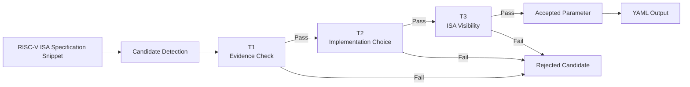
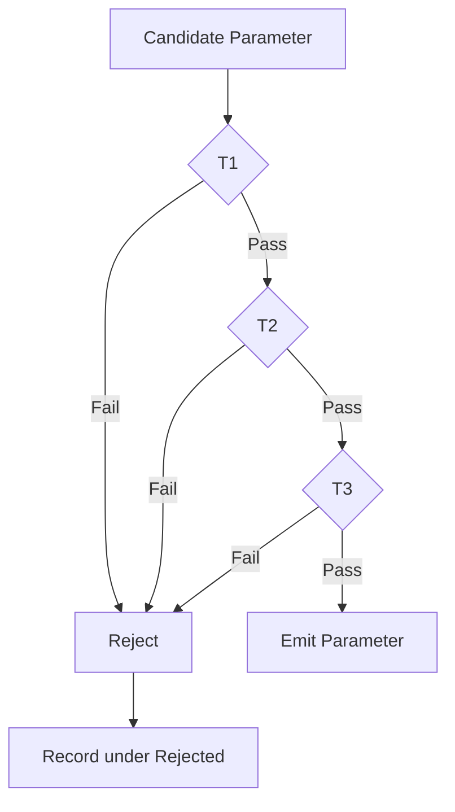
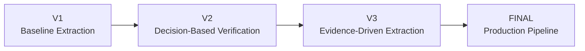

# Prompt Version 2 — Decision-Based Architectural Parameter Extraction

## Objective

Version 2 extends the baseline extraction framework introduced in V1 by introducing
a formal decision process before a candidate is accepted as an architectural
parameter.

Rather than relying only on trigger words (such as *implementation-defined* or
*optional*), every candidate must pass three architectural tests.

This significantly reduces false positives while improving extraction
consistency across different Large Language Models.

---

# Pipeline Overview



---

# Decision Framework

Every extracted candidate is evaluated using the following sequence.



---

# Extraction Strategy

Version 2 performs extraction in two distinct stages.

1. Detect every possible architectural candidate.
2. Verify every candidate using architectural decision rules.

Candidates that fail verification are explicitly recorded as rejected rather than silently ignored.

---

# Verification Tests

## T1 — Evidence Test

Question

> Is the candidate explicitly supported by the supplied specification text?

Purpose

Prevents hallucinations.

Failure Result

Candidate is rejected because it is not grounded in the provided passage.

---

## T2 — Implementation Choice Test

Question

> Does the implementation genuinely choose this value?

Purpose

Distinguishes implementation parameters from architectural constants.

Examples rejected here include

- fixed bit widths
- mandatory encodings
- architectural conventions

---

## T3 — ISA Visibility Test

Question

> Can software observe this choice through the ISA?

Purpose

Separates architectural parameters from purely microarchitectural decisions.

Examples rejected here include

- pipeline depth
- branch predictor size
- cache replacement policy

---

# Accepted Output

Candidates passing all three tests are emitted under

```yaml
parameters:
```

Each parameter includes

- name
- description
- type
- constraints

---

# Rejected Candidates

Version 2 also records rejected candidates.

This makes the extraction process transparent and helps explain why a potential
parameter was excluded.

Typical rejection reasons include

- Not stated in text
- Fixed by architecture
- Not ISA visible

---

# Improvements over V1

| Feature | V1 | V2 |
|----------|----|----|
| Trigger-based extraction | ✓ | ✓ |
| Architectural verification | ✗ | ✓ |
| Explicit rejection reasoning | ✗ | ✓ |
| Reduced false positives | ✗ | ✓ |
| Better consistency across models | ✗ | ✓ |

---

# Advantages

- Better precision
- More explainable extraction
- Lower hallucination rate
- Easier benchmarking across LLMs
- Stronger architectural reasoning

---

# Known Limitations

Version 2 still relies on a single extraction pass.

Evidence verification is stronger than V1, but excerpts are not yet validated
against the original specification.

Grounding checks and confidence estimation are introduced in later prompt
versions.

---

# Evolution

```


---

Version 2 serves as the transition from simple keyword-based extraction to a structured architectural decision framework. It establishes the first formal verification layer used throughout the remaining prompt versions.