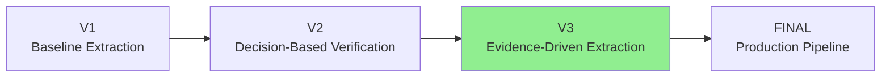

# Prompt Version 3 — Evidence-Driven Architectural Parameter Extraction

## Overview

Version 3 builds upon the decision-based reasoning framework introduced in Version 2 by introducing evidence-driven extraction. Instead of relying solely on architectural reasoning, every extracted parameter must now be supported by explicit evidence copied directly from the specification.

This version is designed to significantly reduce hallucinations while improving the reproducibility and traceability of extracted architectural parameters.

---

---

# Evolution of Prompt Design

| Version | Primary Goal | Major Improvement |
|----------|--------------|------------------|
| **V1** | Baseline parameter extraction | Simple prompt for identifying architectural parameters |
| **V2** | Decision-based reasoning | Introduced T1–T3 verification to reduce false positives |
| **V3** | Evidence-driven extraction | Introduced T4 evidence verification and hallucination prevention |
| **FINAL** | Production-ready extraction pipeline | UDB-aware validation, schema verification, automation support |

---

# Phase 1 — Baseline Extraction (V1)

The first prompt focused on identifying architectural parameters using common specification keywords such as

- may
- optional
- implementation-defined
- implementation-specific

Although capable of extracting parameters, Version 1 frequently accepted false positives because every candidate was treated almost equally.

---

# Phase 2 — Decision-Based Verification (V2)

Version 2 introduced an explicit reasoning framework.

Every candidate parameter was required to pass three sequential verification tests before being accepted.

## T1 — Text Grounding

Is the candidate explicitly supported by the provided specification?

---

## T2 — Implementation Choice

Does the implementation genuinely choose this value?

---

## T3 — ISA Visibility

Can software observe this implementation choice through the ISA?

Only candidates satisfying all three conditions were extracted.

---

# Phase 3 — Evidence-Driven Extraction (V3)

Version 3 extends the decision framework by introducing textual evidence verification.

Architectural reasoning alone is no longer sufficient.

Every extracted parameter must now be supported by exact evidence copied directly from the specification.

---

## T4 — Evidence Verification

Every accepted parameter must contain

- an exact verbatim excerpt
- the trigger phrase responsible for considering the candidate
- a confidence estimate

If an exact supporting excerpt cannot be copied directly from the specification, the parameter must be rejected.

This requirement makes every extraction independently verifiable.

---

# Improvements over Version 2

Compared to Version 2, Version 3 introduces several improvements.

| Improvement | Purpose |
|------------|---------|
| Evidence-first extraction | Prevent unsupported parameter extraction |
| Exact specification excerpts | Allow downstream evidence validation |
| Trigger recording | Identify why a candidate was considered |
| Confidence estimation | Indicate extraction certainty |
| Stronger hallucination prevention | Reject unsupported model knowledge |

---

# Expected Output

Each extracted parameter should contain

- name
- long_name
- description
- type
- constraints
- excerpt
- trigger
- defined_by
- isa_visible
- confidence

Rejected candidates should include

- candidate
- reason
- excerpt
- explanation

---

# Research Objective

The objective of Version 3 is not only to extract architectural parameters, but also to ensure every extraction is explainable, reproducible, and traceable back to the original specification.

This evidence-driven approach provides a stronger foundation for automated validation, benchmarking, and comparison across multiple large language models before introducing the production-grade extraction pipeline in the final prompt version.