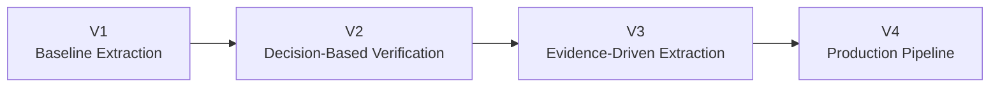
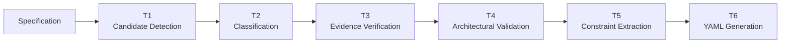
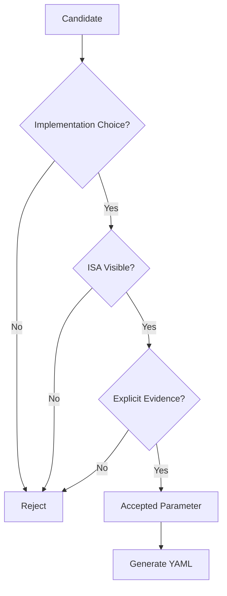
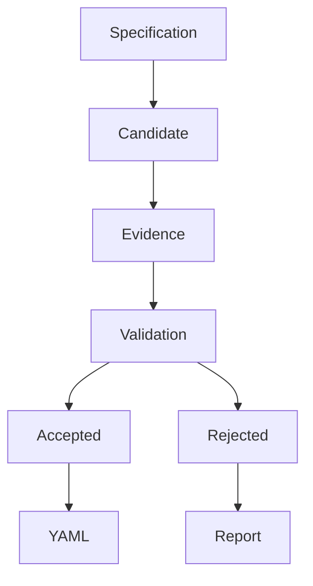

# Prompt Version 4

Production-grade architectural parameter extraction pipeline for the RISC-V ISA.

Unlike previous prompt versions, V4 introduces a structured multi-stage extraction workflow that separates candidate discovery, architectural validation, evidence verification, and final YAML generation. The goal is to maximize precision while minimizing hallucinations and unsupported architectural inferences.

---

# Evolution



---

# Overall Pipeline



---

# Acceptance Workflow



---

# Extraction Pipeline

## T1 — Candidate Detection

Identify every phrase that could reasonably represent an architectural parameter.

No validation is performed during this stage.

Goal:

- High recall
- Maximum candidate coverage

---

## T2 — Parameter Classification

Classify every candidate into one of the following categories.

- Architectural Parameter
- Architectural Constraint
- Architectural Constant
- Descriptive Information
- Microarchitectural Detail
- Other

Only Architectural Parameters continue.

---

## T3 — Evidence Verification

Every accepted parameter must be supported by an exact verbatim excerpt copied from the specification.

If exact evidence cannot be produced, the candidate is rejected.

---

## T4 — Architectural Validation

Verify that the candidate satisfies all architectural requirements.

A valid parameter must

- represent an implementation choice
- be observable through the ISA
- be explicitly supported by the supplied text
- not simply describe architectural facts

---

## T5 — Constraint Extraction

Extract only constraints explicitly stated by the specification.

Examples include

- implementation-specific
- implementation-defined
- discoverable
- power-of-two
- alignment requirements
- minimum values
- maximum values

No inferred constraints are permitted.

---

## T6 — YAML Generation

Produce deterministic YAML matching the expected schema.

Only accepted parameters appear in the final output.

Rejected candidates are reported separately.

---

# Decision Process



---

# Improvements over V3

| Capability | V3 | V4 |
|------------|----|----|
| Candidate Detection | ✓ | ✓ |
| Evidence Verification | ✓ | ✓ |
| Architectural Validation | ✓ | ✓ |
| Constraint Extraction | ✓ | ✓ |
| Rich Rejection Categories | Limited | ✓ |
| Deterministic Output | Partial | ✓ |
| Automation Compatible | Partial | ✓ |
| UDB-aware Workflow | Limited | ✓ |

---


# Generated Outputs

```text
raw_response.md
extracted_parameters.yaml
run_metadata.json
```

---

# Objective

The purpose of V4 is to produce reproducible, specification-grounded architectural parameter extraction with deterministic outputs suitable for automated validation, benchmarking, and comparison across multiple Large Language Models.